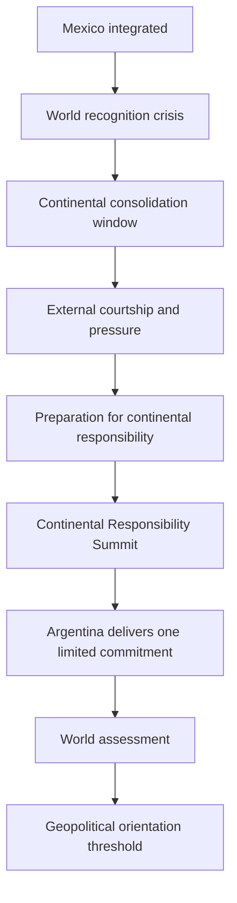
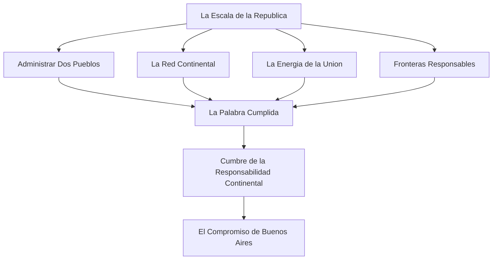

# Argentina Rise - Act I Content Blueprint v1.0

## Authority and scope

This is the executable content blueprint for Act I, **World Takes Notice**. It defines the complete future content surface without implementing any part of it.

It contains no HOI4 code, IDs, localisation, numerical rewards or technical syntax. All listed content must later be implemented from this document and must remain consistent with the five definitive Global Crisis design documents.

### Act boundary

**Start:** Mexico has been fully integrated into Argentina.

**End:** Argentina has completed its first credible continental commitment and can choose a primary geopolitical orientation from a position of earned credibility.

### Act thesis

Argentina is not asked to prove that it can take territory. It is asked to prove that it can govern, supply, reassure and convene at continental scale.

## 1. Content architecture

### The Act I sequence

### Content volume

| Content family | Planned quantity | Function |
|---|---:|---|
| Major narrative events | 11 | Recognition, external reactions, proof and synthesis. |
| New Act I focus content | 8 | Converts Mexico integration into credible continental capacity. |
| Repeatable or one-time player actions | 6 | Gives the player meaningful work in operational windows. |
| Summits | 2 | One global recognition forum, one Argentine-led responsibility summit. |
| Gameplay windows | 4 | Prevents the act from becoming a chain of popups. |

### Design rule

The first summit is not Argentine control. The second summit is not Argentine hegemony. The first makes Argentina visible; the second makes Argentina accountable.

## 2. Millennium Dawn pattern audit

Every content family below uses an existing system family. No new geopolitical metagame is needed for Act I.

| Content need | Existing pattern | Design use in Act I | Reference |
|---|---|---|---|
| International acknowledgement | Recognition and global-news patterns | World reaction to Mexican integration and later assessment | MD `events/International Recognition.txt`; existing Argentina Rise Mexico news flow |
| Bilateral trust and suspicion | Relationship and opinion systems | Different readings by USA, Russia, China, Europe and neighbours | MD opinion modifier families; existing event diplomacy patterns |
| Market confidence and contract capacity | Market access and contract systems | Prove Argentina can sustain continental commitments | MD market effects and market on-actions |
| Investment and development tradeoffs | Country investment and debt patterns | Development choice during the proof window | MD Brazil investment content; bankruptcy and international investment systems |
| Intelligence and resilience | Intelligence agency and upgrade systems | Awareness of scrutiny, protection of routes and counter-pressure | MD intelligence agency systems |
| Institutional alignment | Organisation membership and observer patterns | Introduce future orientation without granting it yet | MD NATO, CSTO, SCO and BRICS families |
| Staged diplomacy | Buenos Aires conference sequence | Continental Responsibility Summit with visible agenda progression | Existing Argentina Rise conference category and tables |
| Existing Argentine capacity | Energy, resources, exports, procurement and reconstruction | Material basis for every promise | Existing Argentina Rise economic and energy systems |

### Explicit exclusions

- No automatic faction membership.
- No automatic foreign investment windfall.
- No sanctions during the opening recognition sequence.
- No war goal, territorial expansion or coercive campaign as Act I's primary proof.
- No Conditional Peace Deals system.
- No new universal prestige meter. Strategic Credibility remains an emergent result of existing systems.

## 3. Major narrative events

### Chronological overview

| Order | Content | Function | When it appears | Window after it |
|---:|---|---|---|---|
| 0 | Mexico fully integrated | Existing threshold notification | On integration completion | Immediate transition into recognition sequence |
| 1 | El Mundo Contiene el Aliento | Argentina chooses its opening posture | Immediately after integration | One day before world news |
| 2 | Una Nueva Potencia Continental | The world recognises the new reality | One day later | Thirty-six hours before UN scene |
| 3 | La Noche de Nueva York | Global powers define the crisis | Thirty-six hours later | Two days before Washington answer |
| 4 | El Hemisferio en Disputa | USA establishes its first posture | Two days later | One day before Argentine dispatch |
| 5 | Despacho de Nueva York | Argentina absorbs the American answer | One day later | Two-day transition to Russian answer |
| 6 | Un Contrapeso en el Sur | Russia responds | Two days later | Two-day transition to Chinese answer |
| 7 | La Pregunta de Beijing | China responds | Two days later | Two-day transition to European answer |
| 8 | Europa Calcula la Distancia | Europe responds collectively but not monolithically | Two days later | Two-day transition to synthesis |
| 9 | Las Respuestas del Mundo | Argentina receives the first strategic map | Two days later | Long consolidation window |
| 10 | La Prueba de la Republica | The world assesses Argentina's continental commitment | After the commitment has been carried through | Orientation preparation window |
| 11 | El Mapa que Hemos Hecho | Act I synthesis and orientation threshold | After assessment | Full transition to Act II |

### Event contract: El Mundo Contiene el Aliento

**Narrative purpose:** Argentina understands that Mexico has changed the country's scale and must choose how its rise will first be presented.

**Gameplay purpose:** establish one opening posture without locking the player into a permanent geopolitical route.

**When it appears:** immediately after Mexican integration.

**Logical trigger:** integration is complete and the Global Crisis has not already begun.

**Player objective:** choose an initial language for Argentina: multipolar balance, strategic autonomy or vigilant detente.

**World change:** the diplomatic reading of Argentina begins to diverge across capitals.

**Emotion:** pride becomes exposure.

**Connection:** leads directly to global recognition news.

**Post-event play window:** none beyond the short initial pause; the opening must remain a single historic sequence.

**Reward type:** a first diplomatic posture, future relationship openings and a clear lens through which other actors react.

### Event contract: Una Nueva Potencia Continental

**Narrative purpose:** make the Mexican integration a world fact rather than an Argentine private triumph.

**Gameplay purpose:** communicate that international attention will now shape the player's available options.

**When it appears:** one day after the opening posture.

**Logical trigger:** Argentina has stated its posture and the integration has become internationally visible.

**Player objective:** understand the transition from national campaign to global campaign.

**World change:** major powers, markets and regional states begin treating Argentina as a continental actor.

**Emotion:** pressure and scale.

**Connection:** convenes the symbolic UN debate.

**Post-event play window:** brief; the global sequence continues before the player is released into a longer operational interval.

**Reward type:** international visibility and the opening of future global relationship channels.

### Event contract: La Noche de Nueva York

**Narrative purpose:** place Argentina inside the diplomatic room where the world order is debated, without falsely granting it institutional dominance.

**Gameplay purpose:** explain the competing interpretations that will govern the next phase: security, balance, predictability, law and sovereignty.

**When it appears:** thirty-six hours after global recognition.

**Logical trigger:** the international situation has become important enough for emergency multilateral scrutiny.

**Player objective:** hear the stakes before the first great-power answer arrives.

**World change:** the crisis becomes an explicit international issue, not merely a regional concern.

**Emotion:** solemnity and legitimacy under scrutiny.

**Connection:** releases Washington from ambiguity and leads to the US strategic response.

**Post-event play window:** two days, preserving a believable period for consultation and strategic reassessment.

**Reward type:** no material reward. The reward is narrative status: Argentina is now impossible to ignore.

### Event contract: El Hemisferio en Disputa

**Narrative purpose:** Washington converts concern into a concrete posture: containment, armed prudence or pragmatic recognition.

**Gameplay purpose:** set the first external pressure condition the player must understand and play around.

**When it appears:** two days after the UN debate.

**Logical trigger:** USA is a viable sovereign actor; otherwise the global chain uses the established non-blocking fallback.

**Player objective:** recognise what kind of American relationship must be managed during the first proof window.

**World change:** the hemisphere gains a visible strategic temperature.

**Emotion:** gravity. The player has made Washington recalculate.

**Connection:** leads to a brief Argentine dispatch, then allows Russia and China to interpret the American signal.

**Post-event play window:** one day before the Argentine dispatch, followed by a staged two-day international sequence.

**Reward type:** a clear geopolitical condition, not a bonus. It tells the player which forms of restraint, resilience or dialogue matter next.

### Event contract: Despacho de Nueva York

**Narrative purpose:** give Buenos Aires a human and political moment to absorb the American answer.

**Gameplay purpose:** prevent the foreign reaction from feeling abstract; translate it into an Argentine operational question.

**When it appears:** one day after the American answer.

**Logical trigger:** a US result exists or an absence fallback has been recorded.

**Player objective:** understand whether Argentina must prepare against pressure, protect a dialogue or keep options open.

**World change:** Argentina begins responding strategically rather than merely receiving judgement.

**Emotion:** sober responsibility.

**Connection:** moves the camera from Washington to Moscow.

**Post-event play window:** two days before Russia answers, then two days before China answers, then two days before Europe. These are still narrative intervals, not the main operational window.

**Reward type:** clarity of purpose for the upcoming consolidation period.

### Event contract: Un Contrapeso en el Sur

**Narrative purpose:** show that Russia sees an opportunity, but not a client state waiting to be claimed.

**Gameplay purpose:** make multipolar dialogue an option with conditions, not a reward for anti-American posture.

**When it appears:** two days after the Argentine dispatch.

**Logical trigger:** Russia is a viable sovereign actor; otherwise a cautious fallback preserves the chain.

**Player objective:** understand whether Russian interest is an opening, a delay or a warning about overcommitment.

**World change:** Argentina acquires a potential eastern strategic interlocutor.

**Emotion:** possibility mixed with caution.

**Connection:** China is now able to assess both Argentine posture and the Russian response.

**Post-event play window:** two days before the Chinese answer.

**Reward type:** preliminary strategic dialogue, not membership, protection or military integration.

### Event contract: La Pregunta de Beijing

**Narrative purpose:** make China's response about durability, commerce and predictability rather than ideological alignment.

**Gameplay purpose:** introduce development partnership as a geopolitical choice with dependence risks.

**When it appears:** two days after Russia's answer.

**Logical trigger:** China is a viable sovereign actor; otherwise a cautious fallback preserves the chain.

**Player objective:** learn whether Argentina is seen as an investable long-term actor, an observation case or an unacceptable risk.

**World change:** economic sovereignty becomes a visible dimension of Argentina's international status.

**Emotion:** being measured by the future rather than the past.

**Connection:** Europe now judges the accumulated American, Russian and Chinese pattern.

**Post-event play window:** two days before the European answer.

**Reward type:** a potential development dialogue, no immediate infrastructure or material transfer.

### Event contract: Europa Calcula la Distancia

**Narrative purpose:** represent Europe as divided among legal caution, Atlantic alignment and commercial pragmatism.

**Gameplay purpose:** demonstrate that legitimacy and market access are related but not identical.

**When it appears:** two days after China's answer.

**Logical trigger:** the global chain has established prior answers; Europe may be represented through current European membership rather than a fictional unified country.

**Player objective:** understand whether the next proof must prioritise restraint, commercial reliability or strategic resilience.

**World change:** Argentina's rise is normalised, questioned or commercially welcomed by different European voices.

**Emotion:** complexity. The player sees that no single western answer exists.

**Connection:** leads to Argentina's first strategic synthesis.

**Post-event play window:** two days before synthesis.

**Reward type:** a legitimacy condition that changes the meaning of later trade and dialogue.

### Event contract: Las Respuestas del Mundo

**Narrative purpose:** close the opening reaction sequence and give Argentina a readable international map.

**Gameplay purpose:** release the player into the long consolidation window with a clear understanding of what must be built next.

**When it appears:** two days after the European answer.

**Logical trigger:** the chain has either received or safely substituted all four external readings.

**Player objective:** identify the immediate Argentine agenda: reliability, regional reassurance, resilience, development readiness or diplomatic balance.

**World change:** the first impressions of Argentina become durable expectations.

**Emotion:** direction without closure.

**Connection:** unlocks the Act I capacity branch, the operational category and the preparation for the Continental Responsibility Summit.

**Post-event play window:** the longest window of the act. The player should have enough time to consolidate capacity and prepare the first commitment.

**Reward type:** access to the Act I operational content and a visible map of foreign expectations.

### Event contract: La Prueba de la Republica

**Narrative purpose:** show that Argentina's first continental commitment has been seen and judged.

**Gameplay purpose:** convert completed preparation and delivery into Strategic Credibility, while making the player face the obligations created by success.

**When it appears:** after the selected Continental Responsibility commitment reaches its intended conclusion.

**Logical trigger:** the summit has concluded and Argentina has delivered its chosen commitment without abandoning the act's core stability conditions.

**Player objective:** recognise which kind of power Argentina has demonstrated itself to be.

**World change:** external actors revise their assessment from speculation to evidence.

**Emotion:** earned confidence, never triumphal certainty.

**Connection:** opens the final orientation synthesis.

**Post-event play window:** a medium repositioning period in which the player reads the consequences and prepares the next act.

**Reward type:** a durable diplomatic opportunity, strengthened legitimacy or a clearer development/security path based on the commitment delivered.

### Event contract: El Mapa que Hemos Hecho

**Narrative purpose:** end Act I by showing that Argentina has not merely inherited a new map; it has begun to create a new political map around it.

**Gameplay purpose:** make the geopolitical orientation threshold available without forcing a permanent choice on the player at the exact moment of the event.

**When it appears:** after the proof assessment and its immediate aftermath.

**Logical trigger:** Act I commitment has been assessed and Argentina remains capable of choosing a coherent future.

**Player objective:** compare viable directions according to the relationships, capacity and legitimacy earned during the act.

**World change:** Argentina is now treated as a power with a direction, not only as a crisis to contain.

**Emotion:** mature power and anticipation.

**Connection:** leads into Act II, where a primary geopolitical orientation is chosen and developed.

**Post-event play window:** full, open-ended transition into the next act.

**Reward type:** access to a set of geopolitical orientation routes, each with distinct obligations and possibilities.

## 4. Act I focus content

The focus content below does not repeat the world reaction sequence. Its job is to give the player long-horizon work during the first global crisis.

### Structure

### La Escala de la Republica

**Narrative purpose:** Argentina accepts that continental scale is not an addition to the old state; it is a new governing condition.

**Gameplay purpose:** open the Act I capacity branch and orient the player toward consolidation before alignment.

**Availability:** after the opening global reaction synthesis.

**What it represents:** the political decision to treat integration as a whole-of-state responsibility.

**What it unlocks:** the four capacity priorities, the Continental Credibility operational category and the path to the Argentine-led summit.

**Power fantasy:** the player becomes the administrator of a continental republic, not merely its conqueror.

**Reward type:** a new operational horizon and access to capacity-building choices.

**Pattern basis:** existing Argentina Rise reconstruction and regional-prestige branches.

### Administrar Dos Pueblos

**Narrative purpose:** prove that integration means shared institutions and governable citizenship, not a map recoloured overnight.

**Gameplay purpose:** make internal cohesion a condition for international legitimacy.

**Availability:** after the Act I root content.

**What it represents:** the administrative, civic and public-service work of a continental state.

**What it unlocks:** stronger regional reassurance options and access to the first commitment's social-responsibility framing.

**Power fantasy:** a state capable of turning victory into belonging.

**Reward type:** new regional trust opportunities and a more credible diplomatic posture.

**Pattern basis:** existing Argentina Rise reconstruction, state-building and social capacity content.

### La Red Continental

**Narrative purpose:** the new Argentina must move people, goods and authority across a continental space.

**Gameplay purpose:** connect logistics and infrastructure to export reliability, regional access and summit credibility.

**Availability:** after the Act I root content.

**What it represents:** continental transport, supply continuity and productive connection.

**What it unlocks:** infrastructure-oriented preparation actions and the logistics framing of the first commitment.

**Power fantasy:** the player binds the continent together through capability rather than force.

**Reward type:** new market, trade and regional-infrastructure opportunities.

**Pattern basis:** existing Argentina Rise infrastructure and resource-development content; MD market and contract systems.

### La Energia de la Union

**Narrative purpose:** energy becomes proof that Argentina can sustain a larger society and support a more stable region.

**Gameplay purpose:** connect domestic energy resilience to external reliability and regional leadership.

**Availability:** after the Act I root content.

**What it represents:** a continental energy responsibility, not a simple production bonus.

**What it unlocks:** energy-oriented preparation actions and the supply framing of the first commitment.

**Power fantasy:** Argentina becomes the power that keeps the lights on when uncertainty spreads.

**Reward type:** new energy diplomacy opportunities and stronger domestic resilience.

**Pattern basis:** existing Argentina Rise energy construction, surplus and export systems; MD energy and market logic.

### Fronteras Responsables

**Narrative purpose:** Argentina demonstrates that a new continental frontier will be governed with vigilance and restraint rather than permanent escalation.

**Gameplay purpose:** connect security, intelligence and regional reassurance to the legitimacy of Argentina's rise.

**Availability:** after the Act I root content.

**What it represents:** border awareness, maritime and infrastructure security, and disciplined strategic posture.

**What it unlocks:** security-oriented preparation actions and the stability framing of the first commitment.

**Power fantasy:** a power that is difficult to surprise and too disciplined to provoke cheaply.

**Reward type:** new resilience and security-dialogue opportunities.

**Pattern basis:** existing Argentina Rise intelligence content; MD intelligence agency and security systems.

### La Palabra Cumplida

**Narrative purpose:** Argentina decides that international status must be earned by delivery, not declaration.

**Gameplay purpose:** converge the four capacity priorities into a readiness threshold for the continental commitment.

**Availability:** after the player has substantially developed at least three of the four capacity priorities. The omitted priority remains a meaningful weakness that affects later options.

**What it represents:** the point at which Argentina can responsibly promise something beyond its borders.

**What it unlocks:** the Continental Responsibility Summit.

**Power fantasy:** the player earns credibility through preparation.

**Reward type:** access to the first Argentine-led continental test.

**Pattern basis:** existing Argentina Rise convergence focuses and conference unlock flow.

### Cumbre de la Responsabilidad Continental

**Narrative purpose:** Buenos Aires invites the region to judge whether Argentina's new scale can serve a shared continental purpose.

**Gameplay purpose:** convert capacity into a public agenda and let the player choose one limited commitment.

**Availability:** after La Palabra Cumplida and the opening global crisis.

**What it represents:** a summit of responsibility, not a coronation.

**What it unlocks:** the summit agenda, a selected continental commitment and the final proof window.

**Power fantasy:** Argentina convenes because it can offer something real, not because it demands obedience.

**Reward type:** one new continental initiative and its associated relationship, market or security opportunity.

**Pattern basis:** the existing Buenos Aires conference sequence.

### El Compromiso de Buenos Aires

**Narrative purpose:** Argentina begins delivering the promise made at the summit.

**Gameplay purpose:** start the final Act I operational test, linking domestic capacity to a regional outcome.

**Availability:** after the summit has selected one agenda.

**What it represents:** the public conversion of Argentine capacity into a continental responsibility.

**What it unlocks:** the delivery window and the proof assessment.

**Power fantasy:** the player proves that leadership can be operational.

**Reward type:** a durable diplomatic opportunity, regional legitimacy and an orientation-relevant reputation.

**Pattern basis:** MD investment, market, relationship and conference systems; existing Argentine energy, resources and infrastructure content.

## 5. Act I player actions

The actions below create meaningful work between narrative moments. Costs are intentionally described by category rather than numbers; final values belong to balance design, not content design.

### Continental Credibility category

**Purpose:** give the player a visible operational home during the long window after global recognition.

**Availability:** after La Escala de la Republica and before the orientation threshold.

**Design rule:** this category is not a generic bonus shop. Every action must prepare a specific kind of commitment or reduce a specific kind of exposure.

### Audit of Continental Capacity

**Function:** lets the player identify which of the four capacity priorities is weakest: administration, network, energy or security.

**Duration:** short assessment period.

**Repeatability:** once per Act I phase, then again only after a major external change.

**Cost:** low political capital.

**Gameplay loop link:** read the international situation, then choose an agenda based on a real domestic constraint.

**Why use it:** it gives the player a clear, non-numerical diagnosis instead of forcing blind optimisation.

**Pattern basis:** existing information and status actions in the Buenos Aires conference category.

**Reward type:** clarity, a recommended preparation path and access to the corresponding capacity action.

### Secure the Continental Supply Chain

**Function:** prioritise continuity of strategic goods, transport and production across the integrated continental space.

**Duration:** medium operational period.

**Repeatability:** repeatable with a meaningful cooldown; each use must address a current vulnerability rather than stack permanent gains.

**Cost:** moderate Treasury commitment and temporary administrative attention.

**Gameplay loop link:** build domestic and regional capacity before making an external promise.

**Why use it:** it makes trade reliability, summit commitments and market confidence more believable.

**Pattern basis:** MD market and contract systems; existing Argentine resource and infrastructure actions.

**Reward type:** stronger reliability for market and regional engagement, not a direct material windfall.

### Protect Strategic Energy Resilience

**Function:** reserve, connect or safeguard energy capacity so that continental responsibility does not undermine domestic stability.

**Duration:** medium operational period.

**Repeatability:** repeatable with a longer cooldown and situational usefulness.

**Cost:** Treasury commitment, energy capacity and an opportunity cost against immediate export use.

**Gameplay loop link:** choose whether energy serves domestic resilience, regional responsibility or external trade.

**Why use it:** it prevents global diplomacy from being detached from Argentina's energy reality.

**Pattern basis:** existing Argentina Rise energy surplus, construction and export systems.

**Reward type:** stronger resilience and access to the energy-supply summit agenda.

### Regional Reassurance Mission

**Function:** send an Argentine political and technical mission to reassure selected regional partners that continental leadership will be reciprocal.

**Duration:** short diplomatic period.

**Repeatability:** limited; each regional relationship should not be solved by repetition.

**Cost:** political capital and a modest Treasury commitment.

**Gameplay loop link:** regional stewardship as the ethical and practical base of global legitimacy.

**Why use it:** it reduces the gap between Argentine intention and regional perception before the summit.

**Pattern basis:** existing conference tables, relationship patterns and regional diplomatic content.

**Reward type:** a new regional partner opening, improved summit reception or reduced suspicion.

### Strategic Risk Review

**Function:** assess external pressure, vulnerable routes and foreign scrutiny before Argentina makes a visible commitment.

**Duration:** short assessment period.

**Repeatability:** repeatable with a cooldown when the international environment changes materially.

**Cost:** political capital and intelligence attention.

**Gameplay loop link:** read the world, prepare security, avoid being surprised by the consequences of visibility.

**Why use it:** it lets the player choose restraint or protection before an external test rather than after a failure.

**Pattern basis:** MD intelligence agency systems and existing Argentine intelligence content.

**Reward type:** awareness of risk, access to the security-stability summit agenda and a more informed response to pressure.

### Prepare the Continental Responsibility Summit

**Function:** turn the player's completed preparation into a formal Argentine agenda for the summit.

**Duration:** medium preparation period.

**Repeatability:** once.

**Cost:** significant Treasury and political commitment, representing diplomatic organisation and domestic preparation.

**Gameplay loop link:** commit capacity to diplomacy only after capacity exists.

**Why use it:** it is the bridge between private preparation and public responsibility.

**Pattern basis:** existing Buenos Aires conference opening actions.

**Reward type:** summit activation and access to one continental commitment path.

## 6. Summits

### Emergency UN Security Council session

**Participants:** United States, Russia, China, European voice, Argentina as invited participant; other international actors remain present through the room's institutional atmosphere rather than individual speeches.

**Objective:** establish that Argentina's new continental scale has become a world-order issue.

**Diplomatic tension:** sovereignty versus precedent; stability versus recognition; law versus political reality.

**Possible results:** no binding settlement; instead, the room creates the different interpretations that shape US, Russian, Chinese and European responses.

**Link to subsequent content:** directly leads to the first major-power answer and establishes the diplomatic vocabulary of Act I.

**Narrative purpose:** recognition under scrutiny.

**Gameplay purpose:** no reward; teach the player what the world will measure.

**Emotion:** solemn exposure.

**Pattern basis:** MD international recognition and global news patterns. The summit is a narrative scene, not a simulated UN institution.

### Continental Responsibility Summit

**Participants:** Argentina, selected South American and Central American partners that still exist as sovereign actors, plus observer voices where geopolitical conditions justify them. Mexico is represented internally through Argentine continental responsibility, not as a separate sovereign participant.

**Objective:** demonstrate that Argentine leadership will produce a shared continental good rather than a demand for submission.

**Diplomatic tension:** neighbours want access and stability but fear dependence, unequal benefit and Argentine domination.

**Possible results:** Argentina publicly commits to one of three limited agendas:

1. **Continental Supply Compact:** food, energy and strategic-goods reliability.
2. **Continental Connectivity Compact:** logistics, transport and productive connection.
3. **Continental Stability Compact:** border security, infrastructure protection and crisis de-escalation.

Each agenda creates a different proof window and tilts, but does not determine, the future geopolitical orientation.

**Link to subsequent content:** launches the Act I delivery period, then leads to the proof assessment and orientation threshold.

**Narrative purpose:** Argentina is judged by what it offers, not what it claims.

**Gameplay purpose:** bind the player's domestic preparation to one visible regional responsibility.

**Emotion:** responsibility under public observation.

**Pattern basis:** existing Buenos Aires conference sequence, MD market systems, regional relationships, investment and security structures.

## 7. Gameplay windows

### Window A: After global synthesis - Consolidate the new scale

**Duration:** the longest early Act I operational window.

**Player work:** begin the Act I capacity branch; use the audit; stabilise administration, logistics, energy and security; continue normal production and construction with a continental purpose.

**Relevant MD systems:** market access, contracts, investment exposure, domestic economy, intelligence and existing Argentine energy/resource systems.

**Relevant construction and production:** infrastructure, industrial capacity, energy systems, strategic supply capability and the support networks that make an external promise possible.

**Relevant relationships:** regional reassurance comes first; major-power contacts remain exploratory.

**Player feeling:** ordinary management has become geopolitics.

### Window B: After first courtship - Prepare an agenda

**Duration:** medium operational window.

**Player work:** select which capacity priorities to develop, compare external openings and preserve at least one alternative future.

**Relevant MD systems:** relationships, market confidence, investments, intelligence and organisation observer logic.

**Relevant construction and production:** strategic sectors tied to Argentina's chosen proof agenda; no speculative build should be detached from a diplomatic purpose.

**Relevant relationships:** one external dialogue may deepen, but Latin American legitimacy must be protected.

**Player feeling:** being courted is useful only if Argentina can set terms.

### Window C: After summit activation - Deliver the compact

**Duration:** full operational proof period.

**Player work:** execute the selected supply, connectivity or stability commitment; protect it from market, security and political disruption; maintain domestic balance while it runs.

**Relevant MD systems:** market and contracts, investment/development logic, energy and infrastructure, intelligence and bilateral relations.

**Relevant construction and production:** only the capacity required by the selected compact. This is not a universal build rush.

**Relevant relationships:** regional participants judge delivery; great powers observe whether Argentina can sustain its public language.

**Player feeling:** leadership is a burden that must be carried, not a title that can be claimed.

### Window D: After proof assessment - Reposition

**Duration:** medium-to-long transition into Act II.

**Player work:** read the assessment, repair weak lenses of Strategic Credibility and prepare for a primary orientation.

**Relevant MD systems:** all four Strategic Credibility lenses: legitimacy, reliability, leverage and resilience.

**Relevant construction and production:** targeted correction of whatever the proof exposed as weak.

**Relevant relationships:** convert real partners into deeper dialogue; keep cautious powers from becoming automatic enemies.

**Player feeling:** Argentina has a direction because the player has earned one.

## 8. Reward philosophy

Act I rewards must be opportunities and consequences, not numerical gifts. Every reward should change what the player can credibly attempt next.

| Content result | Reward type | What it changes |
|---|---|---|
| Opening posture | New diplomatic framing | Alters which actors are receptive, cautious or suspicious. |
| World recognition | International visibility | Opens global dialogue and makes legitimacy a live concern. |
| Capacity priorities | New operational opportunities | Gives the player a material basis for a later commitment. |
| Regional reassurance | New partner opening | Improves the chance that leadership is read as reciprocity. |
| Summit preparation | New conference | Converts capacity into a public agenda. |
| Supply compact | New trade and energy opportunity | Makes Argentina relevant as a reliable continental provider. |
| Connectivity compact | New infrastructure and market opportunity | Makes Argentina relevant as a continental connector. |
| Stability compact | New security and resilience opportunity | Makes Argentina relevant as a responsible guardian of regional order. |
| Proof assessment | New geopolitical route access | Makes some orientations more credible and others more costly. |
| Act synthesis | New strategic horizon | Starts the next act with an earned identity rather than a free alignment. |

## 9. Act I progression requirements

The player should not reach the orientation threshold by simply waiting for time to pass. The act requires:

1. completion of the opening reaction sequence;
2. meaningful development of continental capacity across at least three of four priorities;
3. use of the operational category to diagnose and prepare;
4. successful preparation of the Continental Responsibility Summit;
5. selection and delivery of one limited compact;
6. survival of the compact's economic, security and regional consequences;
7. receipt of the world assessment.

This structure ensures that the player arrives at geopolitics through play, not through a menu.

## 10. Content readiness and implementation roadmap

### Ready for immediate implementation after approval

1. The opening global recognition sequence, including the UN interlude and the Argentine dispatch.
2. The Act I root content and four capacity priorities.
3. The Continental Credibility operational category and its six player actions.
4. The Continental Responsibility Summit structure and its three agenda outcomes.
5. The proof assessment and Act I orientation threshold.

### Requires one final Lead Designer confirmation

The content is otherwise fixed. The Lead Designer must confirm one presentation choice before implementation:

**Should the Continental Responsibility Summit use the full set of eligible Latin American sovereign partners, or a curated core delegation with additional states represented as observers?**

Recommendation: use a curated core delegation. It keeps the summit legible, avoids a crowded diplomatic cast and allows the player to recognise individual regional relationships.

### Recommended implementation order

1. Reconcile the existing Global Crisis technical blueprint with the approved New York interlude and Argentine dispatch.
2. Implement the opening recognition sequence and verify all non-blocking actor fallbacks.
3. Implement the Act I root and capacity content, with no summit rewards yet.
4. Implement the Continental Credibility operational category and verify that every action creates a real preparation choice.
5. Implement the Continental Responsibility Summit and the three compact paths.
6. Implement the delivery windows, proof assessment and orientation threshold.
7. Add localisation, art direction, balancing and full gameplay testing only after the content flow is stable.

## Conclusion

Act I now has a complete playable purpose. The player does not wait for foreign reactions. The player builds the continental capacity that makes Argentina's first international commitment believable, chooses what responsibility to assume and proves that Argentina can lead without demanding submission.

Once the summit delegation presentation is confirmed, this blueprint is ready to be translated into detailed technical specifications and then into gameplay implementation.
