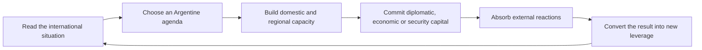

# Argentina Rise - Global Crisis Gameplay Loop v1.0

## Purpose

This document defines the gameplay loop for the second half of Argentina Rise.

It does not define narrative content, focus content, events, decisions, code, IDs, localisation, effects, or technical implementation. It answers one question only:

> Between one major diplomatic moment and the next, what does the player do?

The answer must be substantial enough to sustain dozens of hours after Mexico has been integrated. The player must play a geopolitical campaign, not wait for a sequence of foreign reactions.

## 1. The central promise

After Mexico, Argentina Rise changes genre gradually.

The earlier campaign is about survival, recovery, state-building, continental ambition and the transformation of Argentina itself. The later campaign is about managing the world that Argentina's transformation has disturbed.

The player is no longer rewarded primarily for becoming stronger. The player is rewarded for becoming more credible, more difficult to isolate, more useful to partners and more capable of preventing others from defining Argentina's future.

The core emotional movement is:

1. **I made Argentina powerful.**
2. **The world has noticed.**
3. **The world now expects, fears and bargains with Argentina.**
4. **I can shape the order around Argentina without losing its autonomy.**

## 2. The core gameplay loop

### The full cycle

### Step 1: Read the international situation

The player begins by understanding what has changed outside Argentina.

This is not passive reading. The player identifies:

- which powers are worried, receptive or divided;
- which partners need something Argentina can provide;
- where economic opportunity is opening or closing;
- which regional tensions could become tests of Argentine leadership;
- whether Argentina needs visibility, restraint, preparation or mediation.

The player should never face a completely blank board. Every major diplomatic moment leaves a world state that creates two or three meaningful next questions.

### Step 2: Choose an Argentine agenda

The player chooses one priority for the next period of play. An agenda is not a permanent alignment. It is the practical answer to a current geopolitical moment.

Typical agendas include:

- reduce international suspicion;
- secure market confidence;
- deepen a bilateral strategic opening;
- reassure Latin American partners;
- protect a critical supply route;
- demonstrate independent capacity;
- convene a regional or global conversation;
- prepare for an external pressure campaign.

The crucial design rule is that the player cannot advance every agenda at once. Choosing one should postpone, complicate or make more expensive another.

### Step 3: Build domestic and regional capacity

This is the main answer to the question of what the player does between major narrative moments.

Argentina must turn its new scale into usable capacity:

- stabilise the integrated continental economy;
- maintain reliable production, energy and transport;
- decide which strategic sectors deserve protection or opening;
- develop the ability to offer trade, supply, investment, mediation or security to others;
- maintain regional trust through visible responsibility, not rhetoric alone.

The player is playing the map, economy, market, infrastructure, armed forces and diplomatic relationships as connected instruments. A summit has weight only if Argentina can deliver what it promises afterwards.

### Step 4: Commit diplomatic, economic or security capital

The player turns preparation into an external move. This can be a partnership, a conference, an offer, a public posture, a regional guarantee of respect, a development proposal, a security signal, a market opening or an act of restraint.

Every commitment must have three properties:

1. it changes how at least one external actor reads Argentina;
2. it creates an obligation, exposure or opportunity that remains after the immediate scene;
3. it opens a new question rather than simply ending a chain.

### Step 5: Absorb external reactions

The world answers. It may reward, question, delay, counteroffer, test, contain, imitate or attempt to isolate Argentina.

This phase must not be a punishment interlude. It gives the player information: who can be trusted, where leverage exists, which dependencies have become visible and what Argentina must build next.

### Step 6: Convert the result into new leverage

The result of one geopolitical cycle must feed the next. A successful regional initiative improves credibility for a global table. A strong market outcome makes a partnership less dependent. A security crisis handled with restraint gives Argentina greater legitimacy. A rejected proposal reveals which alternative partner or domestic capacity is now required.

The loop then restarts at a higher level of complexity, not simply with larger numbers.

## 3. The five player activities

The second half should be organised around five interlocking activities. They are all necessary. None should become a separate minigame with no consequence for the others.

### 3.1 Statecraft and diplomatic positioning

**Objective:** decide how Argentina is understood by other powers and where it places its political weight.

**Power fantasy:** the player is the strategist whose choice of language, partner and timing can change how capitals calculate.

**What the player does:**

- reads external interests and divisions;
- chooses whether to reassure, challenge, delay, mediate or convene;
- builds bilateral and multilateral confidence gradually;
- keeps alternative relationships alive rather than accepting a single inevitable patron;
- decides when visibility helps and when silence preserves freedom.

**Consequences:** greater access can create expectations; public independence can earn respect but reduce immediate support; a strong partnership can deter one pressure while triggering another.

**Connection to other activities:** diplomacy needs economic reliability, regional legitimacy and security credibility. It determines which economic offers become available and which threats must be prepared for.

### 3.2 Economic sovereignty and continental capacity

**Objective:** convert territorial scale into a stable, useful and credible Argentine economy.

**Power fantasy:** the player is not spending a windfall. The player is turning a continental economy into the foundation of independent world influence.

**What the player does:**

- prioritises infrastructure, energy, transport, industrial reliability and export capacity;
- chooses whether key sectors are opened, protected, diversified or used as bargaining tools;
- manages investment, debt exposure, market access and trade relationships;
- develops the capacity to offer partners something real: food, energy, industrial production, logistics, finance or technology;
- balances short-term gains against long-term dependence.

**Consequences:** prosperity creates leverage only if it is stable. A highly profitable foreign relationship can create political vulnerability. A refusal of outside capital can preserve autonomy but slow continental consolidation.

**Connection to other activities:** economic capacity makes diplomacy credible, funds security, creates regional obligations and gives global leadership material content.

### 3.3 Security, resilience and strategic restraint

**Objective:** protect Argentina from coercion, miscalculation and external pressure without turning the campaign into endless warfare.

**Power fantasy:** the player is the guardian of a power too important to be surprised and too disciplined to be provoked cheaply.

**What the player does:**

- builds readiness appropriate to Argentina's new strategic exposure;
- protects maritime routes, critical infrastructure and borders;
- develops intelligence awareness and counter-influence capacity;
- signals restraint when escalation would help an opponent;
- prepares credible responses without converting every disagreement into a war.

**Consequences:** security spending can reassure domestic audiences while alarming foreign ones. Transparency can build trust but reveal vulnerabilities. A hard response can deter pressure but damage legitimacy.

**Connection to other activities:** security protects trade and partnerships, but must be justified by diplomacy and paid for by the economy. Regional leadership becomes impossible if neighbours see Argentine security as domination.

### 3.4 Regional stewardship

**Objective:** prove that Argentine leadership improves the political and economic space around Argentina rather than merely enlarging Argentine control.

**Power fantasy:** the player becomes the state that smaller neighbours consult before they choose between larger powers.

**What the player does:**

- maintains regional trust after the Mexican integration;
- offers access, coordination, reconstruction, infrastructure, energy and mediation where Argentine capacity exists;
- responds to regional crises before outside powers monopolise them;
- accepts that partners can negotiate, refuse or demand safeguards;
- builds an Argentine-led regional environment based on reciprocity.

**Consequences:** regional leadership creates obligations. Neglect breeds rivalry, resentment and invitations for external interference. Responsible leadership creates legitimacy that no external bloc can grant.

**Connection to other activities:** regional stewardship provides diplomatic legitimacy, economic markets, strategic depth and the human proof of Argentina's global narrative.

### 3.5 World-order leadership

**Objective:** move from reacting to global politics to convening, mediating and shaping it.

**Power fantasy:** the player becomes the author of agendas that other countries must answer.

**What the player does:**

- identifies international issues where Argentina can credibly convene rather than merely attend;
- builds issue-based coalitions instead of collecting permanent allies;
- spends prestige to mediate, propose, guarantee process or create common projects;
- uses global visibility to protect Argentine autonomy and regional interests;
- decides when not to intervene, preserving influence for a crisis that matters more.

**Consequences:** agenda-setting raises expectations. Failure is public. A country that convenes others cannot act unpredictably without losing credibility. Success creates access that military strength alone cannot buy.

**Connection to other activities:** world-order leadership is the conversion layer. It turns domestic capacity, regional legitimacy, security restraint and diplomatic position into international influence.

## 4. The central invisible resource: Strategic Credibility

### Design decision

The campaign should not introduce a new universal prestige meter.

Millennium Dawn already supplies equivalent building blocks: bilateral relations, market access, investment exposure, debt and confidence pressures, organisational alignment, technology and security relationships, intelligence capacity, and regional institutional participation. Adding a new all-purpose score would duplicate those systems while hiding why Argentina is trusted or distrusted.

The central invisible resource is therefore **Strategic Credibility**. It is not a separate currency. It is the player-facing interpretation of whether Argentina's conduct makes its commitments believable.

### How Strategic Credibility is perceived

Strategic Credibility is created or damaged through four visible lenses:

| Lens | Player question | Existing MD language it can reuse | What it means in play |
|---|---|---|---|
| Legitimacy | Do neighbours and institutions accept Argentina as a responsible power? | relations, recognition, multilateral membership, regional participation | Argentina can convene and mediate without every offer looking like coercion. |
| Reliability | Does Argentina deliver what it promises? | market access, trade relations, investment commitments, debt and confidence systems | Partners accept long-term projects and markets price Argentina as dependable. |
| Leverage | Does Argentina possess something others need? | resources, energy, industry, market systems, infrastructure and trade | Argentina bargains from capacity rather than rhetoric. |
| Resilience | Can Argentina resist pressure without collapsing or lashing out? | security, intelligence, domestic stability, economic depth and organisational ties | Containment, market shocks or diplomatic pressure become problems to manage rather than game-ending punishments. |

### Why this is stronger than a new meter

- It tells the player why a foreign actor reacted as it did.
- It preserves the meaning of existing Millennium Dawn systems.
- It prevents the false idea that every relationship can be solved by filling one bar.
- It allows different routes to be credible for different reasons.
- It makes contradiction meaningful: Argentina can have high leverage and low legitimacy, or strong reliability but weak resilience.

### The player rule

Every substantial action should improve at least one lens while risking another.

Examples of the design logic:

- a large external investment may raise leverage and reliability while lowering autonomy;
- a principled refusal may raise legitimacy with some partners while lowering short-term market confidence;
- a restrained security response may raise legitimacy and resilience while leaving leverage unchanged;
- regional development may raise legitimacy and reliability but create expensive obligations.

This tradeoff is the heart of the loop.

## 5. Existing Millennium Dawn foundations

The following conclusion is based on the systems already present in Millennium Dawn and the existing Argentina Rise patterns.

### No new diplomacy currency is needed

MD already models the components that a generic diplomatic influence meter would duplicate:

- relationships and named diplomatic perceptions;
- market access and economic confidence;
- investment and debt exposure;
- organisational membership and technology-sharing relationships;
- security alignment and intelligence capacity;
- international recognition and regional institutional participation.

Argentina Rise already adds a conference model in which diplomatic progress is staged, visible and consequential. The recommended loop is to combine these foundations around clear player agendas, not to invent a new global board game inside the mod.

### What must be reused conceptually

1. **Market and investment systems** for access, dependence, confidence and development tradeoffs.
2. **Relationship systems** for trust, suspicion, opening and refusal.
3. **International organisation systems** for staged belonging and the cost of alignment.
4. **Intelligence systems** for visibility, protection and external pressure.
5. **Conference structure** for major diplomatic moments with a beginning, middle and consequence.
6. **Regional economic mechanisms** for making leadership concrete rather than ceremonial.

### What must not be copied blindly

- permanent blocs as instant rewards;
- sanctions as the first response to every disagreement;
- broad global systems that force Argentina to interact with every country;
- a generic summit repeated until it loses narrative value;
- unstable or previously problematic interface systems.

## 6. What the player does between major diplomatic moments

### The operational interval

The normal interval after a major diplomatic moment should contain three layers of play:

1. **Consolidate:** stabilise the domestic, continental and economic conditions that made the diplomatic choice possible.
2. **Prepare:** choose the next agenda, build the relevant relationship and protect against foreseeable pressure.
3. **Demonstrate:** take a visible but limited action that proves Argentina's chosen posture is real.

The player should usually have time to complete meaningful work in all three layers before the next world-scale narrative beat arrives.

### Examples of meaningful gameplay without new content design

The following are categories of play, not prescribed content:

- reorganising continental production and logistics to meet an export promise;
- deciding whether energy surplus serves domestic resilience, regional support or external trade;
- building infrastructure that makes a proposed partnership believable;
- improving readiness while avoiding a military posture that looks offensive;
- protecting a strategic sector from vulnerability before entering negotiations;
- choosing which neighbouring relationship needs active repair;
- preparing intelligence awareness before a politically sensitive international move;
- balancing market confidence against a domestic sovereignty demand;
- determining whether Argentina has enough credibility to convene rather than merely attend.

The game must communicate the connection. A player should understand that an economic choice affects a diplomatic promise, and that a regional choice affects the legitimacy of a global claim.

## 7. Pacing model

### Macro rhythm

The Global Crisis should follow a repeating four-beat cadence:

1. **Signal:** a major narrative development changes the strategic situation.
2. **Play window:** the player has time to consolidate, prepare and act.
3. **Test:** an outside actor, market condition, regional demand or security problem tests the previous choice.
4. **Reposition:** the player reads the result and sets the next agenda.

This cadence gives narrative weight without turning the campaign into a slideshow.

### Recommended spacing

- A world-scale narrative moment should be rare and earned.
- Small political or economic consequences can appear between them, but only when they create a choice or reveal new information.
- Major conferences should be separated by enough play time for their commitments to have visible consequences.
- A security crisis should interrupt routine only when the player has previously built something worth protecting.

### The rhythm of agency

The player must never receive three major foreign reactions in a row without a meaningful period of play. Conversely, long quiet periods without a new strategic question make global diplomacy feel ornamental.

The desired rhythm is:

**world speaks -> player acts -> world tests -> player changes the world.**

### Anti-fatigue rules

- Do not use narrative moments to explain every numerical change.
- Do not turn every trade opportunity into a full political scene.
- Do not make every crisis global.
- Do not make every success a permanent buff.
- Do not let a player sit idle waiting for foreign approval.

## 8. Player experience by campaign phase

### Phase One: Recognition

**What the player feels:** exposure, pride and uncertainty.

**What the player seeks:** understand the new international position and prevent others from defining it first.

**New opportunities:** visibility, first dialogues, first market openings, first regional expectations.

**New problems:** suspicion, geopolitical scrutiny, market uncertainty and conflicting external narratives.

### Phase Two: Credibility

**What the player feels:** responsibility.

**What the player seeks:** prove that Argentina can govern continental scale and honour an external commitment.

**New opportunities:** reliable partners, better access, regional leadership, deeper economic projects.

**New problems:** obligations, domestic strain, partner demands, risk of dependence and reputational tests.

### Phase Three: Courtship

**What the player feels:** desirability mixed with danger.

**What the player seeks:** turn external interest into terms that preserve Argentine agency.

**New opportunities:** competing offers, strategic dialogues, development pathways and wider diplomatic reach.

**New problems:** pressure to align, intelligence scrutiny, rival influence and the temptation to accept everything.

### Phase Four: Agenda-setting

**What the player feels:** authorship.

**What the player seeks:** convene a conversation or coalition that would not exist without Argentina.

**New opportunities:** mediation, regional projects, issue coalitions, global visibility and institutional leadership.

**New problems:** public failure, expectation management, regional dissent and the cost of responsibility.

### Phase Five: The test of power

**What the player feels:** consequence.

**What the player seeks:** use accumulated credibility without losing it.

**New opportunities:** durable recognition, a new order, strategic independence or a deep partnership.

**New problems:** escalation, bloc pressure, crisis management, domestic disagreement and the possibility that partners prove conditional.

### Phase Six: An Argentine order

**What the player feels:** mature power.

**What the player seeks:** leave a world in which Argentina has created rules, relationships and capacities that endure.

**New opportunities:** long-term leadership, institutional memory, stable access and a distinctive endgame identity.

**New problems:** maintaining the order, avoiding overextension and accepting that influence requires continuous stewardship.

## 9. Game Design roadmap

### Act I: From conquest to recognition

**Narrative objective:** make clear that Mexico transformed the international map.

**Gameplay objective:** introduce the player to the external reaction loop without overwhelming them.

**Power-fantasy transformation:** from victor to visible power.

### Act II: From recognition to credibility

**Narrative objective:** show that the world is waiting to see whether Argentina can govern what it has become.

**Gameplay objective:** connect domestic capacity, market reliability and regional responsibility to diplomatic opportunity.

**Power-fantasy transformation:** from visible power to reliable power.

### Act III: From credibility to choice

**Narrative objective:** make external courtship morally and strategically complex.

**Gameplay objective:** let the player compare paths through their obligations and tradeoffs, not through raw rewards.

**Power-fantasy transformation:** from reliable power to autonomous negotiator.

### Act IV: From choice to leadership

**Narrative objective:** Argentina begins setting agendas rather than receiving invitations.

**Gameplay objective:** create repeatable cycles of preparation, convening, consequence and repositioning.

**Power-fantasy transformation:** from negotiator to diplomatic centre.

### Act V: From leadership to order

**Narrative objective:** test whether Argentine leadership survives a real international strain.

**Gameplay objective:** require the player to combine economy, security, regional stewardship and diplomacy in one consequential response.

**Power-fantasy transformation:** from diplomatic centre to architect of an order.

## 10. Critical assessment

### Is the loop strong enough for long play?

Yes, with one important condition: the later campaign must always connect external politics to domestic and regional work. The player cannot be sustained for dozens of hours by conferences and foreign statements alone. The loop becomes durable when every diplomatic choice creates an economic, security or regional task, and every completed task creates new diplomatic leverage.

### Current strengths

- The post-Mexico premise is clear and emotionally distinct from the first half.
- Argentina Rise already contains a strong conference precedent.
- Millennium Dawn provides sufficient existing language for markets, relations, investment, organisations and intelligence.
- Strategic Credibility gives the design a unifying idea without requiring a new universal meter.

### Remaining design risks before implementation

1. **Overabundance of external actors:** not every actor should be active in every campaign. The player needs a readable cast per route.
2. **Reward homogenisation:** partnerships must not all become different names for the same industrial gain.
3. **Regional neglect:** global status cannot erase Latin America; regional legitimacy must remain a live requirement.
4. **Narrative overload:** major moments need space, and play windows must contain real operational work.
5. **False autonomy:** a route called autonomous is meaningless if it grants every benefit without sacrifice.

### Final verdict

The gameplay loop is sufficiently solid to support a long second half after Mexico, provided implementation follows its central discipline:

> The player must always be doing the work that makes the next diplomatic moment believable.

The main critical task before implementation is not inventing more world reactions. It is selecting a small, readable set of recurring agendas and making every one of them connect Argentina's domestic capacity, regional legitimacy, security resilience and international position.
