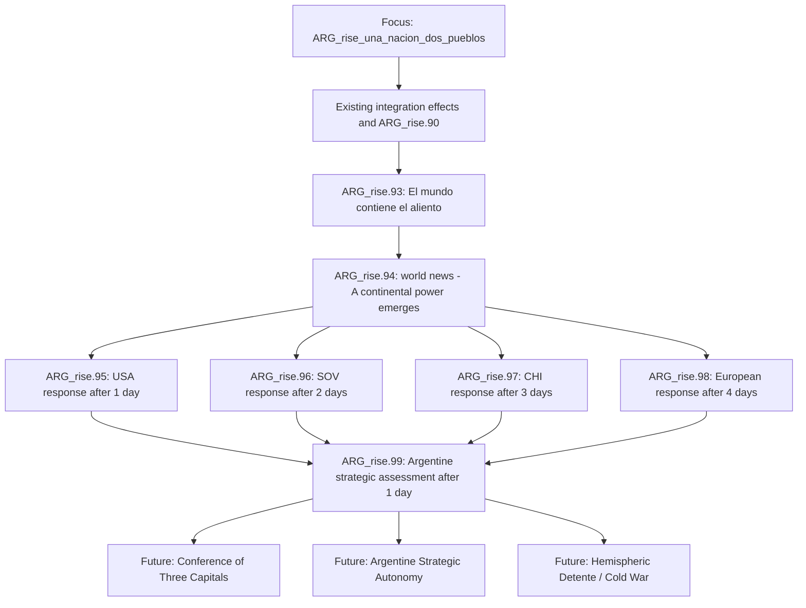

# Argentina Rise - Post-Mexico Global Crisis Events Design v0.1.4

## Scope, status and baseline

This is a **design-only** specification. It creates no gameplay content and does not change the existing Mexico focus, event chain, save files, Millennium Dawn, or vanilla HOI4.

The proposed crisis begins only after the existing focus `ARG_rise_una_nacion_dos_pueblos` has completed its current integration work: Argentine cores in Mexican states 828-840, removal of Mexican claims, and the existing `ARG_rise.90` call. It must be appended to that completion flow, not replace it.

Baseline documents read and used:

- `docs/POST_MEXICO_STRATEGIC_AUTOPSY_v0.1.4.md`
- `docs/CONQUISTA_DEL_MESSICO_DESIGN_v0.1.3.md`
- `docs/ARGENTINA_RISE_DESIGN_BIBLE_v1.0.md`
- `docs/FOCUS_TREE_REVERSE_ENGINEERING_v0.1.3.md`

Code read:

- Submod: `common/national_focus/ARG_rise_focus_tree.txt`, `events/ARG_rise_events.txt`, `common/on_actions/ARG_rise_on_actions.txt`, `common/decisions/ARG_rise_mexico_decisions.txt`, `common/ideas/ARG_rise_ideas.txt`.
- MD: `common/ideas/Factions.txt`, `common/scripted_effects/00_startup_effects.txt`, `common/scripted_effects/02_CSTO_effects.txt`, `common/scripted_effects/99_SOV_scripted_effects.txt`, `common/scripted_effects/99_EU_voting_scripted_effects.txt`, `common/on_actions/MD_on_actions.txt`, `events/NATO_system.txt`, `events/CSTO_system.txt`.

## 1. Design premise

`Una Nacion, Dos Pueblos` should not make the next act a larger version of the Mexican war. Mexico is the proof that Argentina can win a continental war; the crisis is the moment the world recognises that the victory has changed the strategic map.

The opening question is not "who shall Argentina conquer next?" It is:

> What kind of power does Argentina become when its frontier reaches the United States?

The crisis has four jobs:

1. mark the Mexican integration as a world-historical threshold;
2. make USA, SOV, CHI and Europe react with distinct interests;
3. force Argentina to choose a diplomatic posture without granting an alliance, faction or war;
4. set durable but minimal state for the later Three Capitals, Strategic Autonomy, and Hemispheric Cold War paths.

## 2. Verified patterns and technical constraints

| Need | Verified pattern | Source | Design use |
|---|---|---|---|
| Event chain with delay | `country_event = { id = ... days = N }` and `hours = N` | `events/ARG_rise_events.txt`, especially the Mexico chain 83-90 | Queue reactions over several days instead of firing all actors in one tick. |
| International news | `news_event = { id = ... hours = 6 }` from guarded on-actions | `common/on_actions/ARG_rise_on_actions.txt` lines 60-88 | Fire one global news event after the Argentine choice. |
| One-shot state | country/global flags guarded by `NOT = { has_country_flag = ... }` | Mexico and Conferencia branches | Use flags to prevent duplicate crisis/reactions. |
| Opinion change | `add_opinion_modifier` and `reverse_add_opinion_modifier` | Existing MD event/diplomacy patterns | Use named, localised modifiers rather than an invented direct relation system. |
| Controlled diplomatic relation | `diplomatic_relation = { country = TAG relation = guarantee/non_aggression_pact active = yes }` | MD `99_SOV_scripted_effects.txt` | Reserve for later focuses, not this opening chain. |
| CSTO-style staged cooperation | add array entry + idea + tech sharing, with a symmetric leave effect | MD `02_CSTO_effects.txt` | Model the principle of staged institutional cooperation, not copy CSTO membership onto Argentina. |
| SCO/BRICS institutional state | `sco_member*` and `faction_brics_alliance` ideas | MD `common/ideas/Factions.txt` | Model economic/political/military stages before formal defence. |
| Faction transition | `leave_faction` then `create_faction_from_template` | MD `99_SOV_scripted_effects.txt` | Future-only reference for a conditional bloc, never an automatic reward here. |
| EU-wide effect | `every_country = { limit = { has_idea = EU_member } ... }` and `global.EU_member` arrays | MD `99_EU_voting_scripted_effects.txt` | One event-time pass across EU members, not a daily scan. |
| NATO identity | `NATO_member` and startup `global.nato_members` array | MD `Factions.txt`, `00_startup_effects.txt`, `NATO_system.txt` | USA reaction can distinguish NATO alignment without inventing a new western bloc. |

### Explicit exclusions

- No Conditional Peace Deals. The system is disabled in the submod due to a broken GUI flow.
- No direct `EU` tag. It is not the correct generic representation of the European Union.
- No automatic `join_faction`, `create_faction`, guarantee, access, technology sharing, major investment, sanctions, embargo or war in the opening chain.
- No daily `every_country` logic. The EU pass, if implemented, is one-time and bounded by `has_idea = EU_member`.

## 3. How MD represents Europe

MD does **not** require a single playable tag called `EU` to represent European policy.

1. The principal membership test is `has_idea = EU_member`.
2. MD also maintains `global.EU_member` for EU-wide voting/array operations.
3. `EUU` appears in federalisation paths as a United States of Europe outcome, not as the ordinary EU actor.
4. NATO overlaps with Europe but is not equivalent to it. `NATO_member` includes non-EU states and the USA; EU members may be strategically divided.

### Correct European response model

The crisis should use a two-level response:

- **Collective layer:** a one-time hidden effect iterating EU members with `has_idea = EU_member`, applying a small, posture-dependent Argentine opinion modifier.
- **Voice layer:** news localisation and optional country events for a small, real set of existing major tags: `FRA`, `GER`, `ITA`, `ESP`, and `ENG` where they exist. They communicate disagreement without pretending that one tag speaks for the whole continent.

The opening chain should not try to decide the EU's internal balance permanently. It only records whether the immediate reaction was Atlantic condemnation, diplomatic caution, or commercial pragmatism.

## 4. Complete event flow

Provisional IDs are a design reservation only. They must be checked against the live `ARG_rise` namespace at implementation time; the current file reaches `ARG_rise.92`.

### Scheduling rule

`ARG_rise.99` must be scheduled only by the last expected reaction event, normally Europe. Each reaction must also set its fallback/complete flag before finishing. If an actor does not exist, a short fallback event or the prior event sets the corresponding `*_unavailable` state and still schedules the next stage. The chain therefore never blocks on a dead, puppeted, civil-war or absent major.

## 5. Event design

### ARG_rise.93 - Argentine opening event

**Working title:** `El Mundo Contiene el Aliento`.

**Trigger and ownership:** fired only for `ARG`, immediately after existing `ARG_rise_una_nacion_dos_pueblos` effects and only if `ARG_rise_post_mexico_crisis_started` is absent.

**Narrative function:** Mexico is no longer a theatre of war but an Argentine political fact. The map now places Argentine institutions against the American frontier. The player chooses how the new power will be read before other capitals define it for them.

| Option | Immediate design state | Suggested immediate diplomacy | Future unlock |
|---|---|---|---|
| A. Multipolar approach | `ARG_rise_post_mexico_multipolar` | ARG-SOV +30, ARG-CHI +30, USA-ARG -45; EU collective -10 | Three Capitals candidacy. |
| B. Strategic autonomy | `ARG_rise_post_mexico_autonomy` | USA-ARG -15; no automatic SOV/CHI gain; Conferencia-facing partners may gain a small positive modifier | Autonomous deterrence branch. |
| C. Vigilant detente | `ARG_rise_post_mexico_detente` | USA-ARG -5, EU collective +10, SOV/CHI -5 | Hemispheric detente / containment branch. |

The numbers are balancing targets, not final script. Each must be implemented as named opinion modifiers with localisation, so the player can understand the relationship change.

All three choices set `ARG_rise_post_mexico_crisis_started` and queue the world news. They are not equivalent: only A opens the formal multipolar conference path; only B protects independent strategic development; only C creates a plausible US pragmatism condition.

### ARG_rise.94 - World news

**Working title:** `Una Nueva Potencia Continental`.

**Form:** `news_event`, `is_triggered_only = yes`, patterned after the Mexico war and Mexico City-fall news events.

**Effects allowed now:**

- set global flag `ARG_rise_post_mexico_world_crisis`;
- optional small world tension addition only after verifying the exact existing MD tension pattern and its balance in the active version; suggested ceiling +1 to +2, never a large jump;
- queue USA, SOV, CHI and European reactions at staggered delays;
- no war, guarantee, faction call, embargo or alliance.

**Reader differentiation:** ARG receives sovereign recognition; USA receives a hemispheric-security alarm; SOV receives an opportunity for strategic balance; CHI receives a trade-and-stability question; EU members receive a divided diplomatic problem; all other countries receive a changing-world-order news frame.

Use tag-specific localisation conditions only where MD's existing news/localisation patterns establish them. The safe fallback is one shared news description plus different country-event voices afterwards.

### ARG_rise.95 - USA response

**Recipient:** `USA`, if it exists, is independent enough to act, and is not already allied with ARG. Otherwise set `ARG_rise_USA_unavailable` on ARG and continue.

| Response | AI posture | Suggested state | Immediate effects | What it must not do |
|---|---|---|---|---|
| Containment | Default when ARG selected multipolarism, USA has NATO context, high tension or low opinion | `ARG_rise_USA_containment` | USA->ARG relation -35 beyond opening modifier; ARG receives containment flag; Europe tends Atlantic | No automatic embargo or war. |
| Armed prudence | Default neutral response when USA is stretched, indebted, already fighting, or Argentina chose autonomy | `ARG_rise_USA_armed_prudence` | relation -20; frontier-deterrence path becomes visible later | No free mobilisation spirit unless a tested USA pattern is adopted. |
| Pragmatic recognition | Rare: ARG chose detente, opinion is not deeply negative, USA is at peace, and NATO/major-war pressure is low | `ARG_rise_USA_pragmatism` | relation 0 to +10 net, a future dialogue path opens | No alliance, guarantee or abandonment of NATO. |

**AI guidance:** use weighted modifiers, not pure random. Containment has high weight for `ARG_rise_post_mexico_multipolar`, poor USA-ARG opinion, `NATO_member`, high world tension and USA not at an exhausting war. Pragmatism needs all favourable conditions and should have a low base. Armed prudence is the safe middle fallback.

### ARG_rise.96 - SOV response

**Recipient:** `SOV`, if it exists, is not a subject, and is not in a condition that prevents ordinary diplomacy. A fallback sets `ARG_rise_SOV_unavailable` or `ARG_rise_SOV_deferred` on ARG.

| Response | AI posture | Suggested state | Immediate effects | Later meaning |
|---|---|---|---|---|
| Strategic opening | Strong ARG multipolar posture, no SOV-ARG war, SOV not critically overstretched, appropriate anti-NATO concern | `ARG_rise_SOV_opening` | ARG-SOV +35; preliminary dialogue flag | Allows the Russian side of Three Capitals. |
| Cautious interest | Default when Argentina is multipolar but SOV has active wars, faction constraints or domestic pressure | `ARG_rise_SOV_cautious` | ARG-SOV +10; later proof/concession requirement | Keeps the path alive without free support. |
| Deferral/refusal | ARG detente, hostile opinion, incompatible live conditions, or SOV crisis | `ARG_rise_SOV_deferred` | no positive commitment; optional -5 opinion | Argentina may retry through a later focus or pursue autonomy. |

**Pattern discipline:** CSTO proves that MD can add institutional membership, array state and tech sharing, but none belongs here. Russia offers a channel, not CSTO membership, a guarantee, a faction or technology in this event.

### ARG_rise.97 - CHI response

**Recipient:** `CHI`, if it exists, is not a subject, and can conduct normal diplomacy. Fallback sets `ARG_rise_CHI_unavailable` or `ARG_rise_CHI_cautious`.

| Response | AI posture | Suggested state | Immediate effects | Later meaning |
|---|---|---|---|---|
| Privileged economic partnership | ARG multipolar or autonomy posture, stable Argentina, no imminent US war, adequate relationship | `ARG_rise_CHI_partnership` | ARG-CHI +35; commercial/energy dialogue flag | Allows a future investment, port or energy negotiation. |
| Interested observation | Default when risks are present but Argentina is stable | `ARG_rise_CHI_observation` | ARG-CHI +10 | Opens proof-of-reliability path, no material commitment. |
| Prudent distance | Imminent escalation, Argentina directly at war with USA, hostile relationship, China crisis or faction constraint | `ARG_rise_CHI_cautious` | no positive commitment; optional -5 opinion | Keeps China outside a premature American confrontation. |

China's event must prioritise trade, investment, energy, logistics and predictability. It must never convert a multipolar Argentine option into automatic Chinese military participation.

### ARG_rise.98 - European response

**Technical shape:** this is not a country event for a fictional `EU` tag. It is a one-time routing effect that:

1. evaluates a small set of real major voices where they exist (`FRA`, `GER`, `ITA`, `ESP`, `ENG`);
2. applies a small posture-dependent named modifier to countries with `has_idea = EU_member` in a single bounded pass;
3. stores one Argentine summary flag based on the dominant response.

| Response | Conditions | State | Immediate effect |
|---|---|---|---|
| Atlantic condemnation | ARG multipolar, USA containment, high tension, strong NATO overlap | `ARG_rise_EU_atlantic_condemnation` | EU members -15 opinion of ARG, with a harsher modifier only for selected Atlantic major voices. |
| Diplomatic caution | USA armed prudence or ARG autonomy | `ARG_rise_EU_diplomatic_caution` | EU members -5 opinion; mediation path remains possible. |
| Commercial pragmatism | ARG detente plus USA pragmatism/armed prudence and low tension | `ARG_rise_EU_commercial_pragmatism` | EU members +5 or neutral modifier; future trade dialogue may open. |

There should be no separate event for every EU state. One shared reaction plus a small number of major-voice localisation variants is more legible and much safer for performance.

### ARG_rise.99 - Argentine strategic assessment

**Working title:** `Las Respuestas del Mundo`.

**Function:** delivers the political consequence of the foreign responses, not a second generic choice. Its description changes according to the actual USA/SOV/CHI/EU flags. It has one acknowledgement option that sets `ARG_rise_post_mexico_crisis_resolved` and activates the appropriate future focus gate(s).

| State combination | Resulting narrative and future gate |
|---|---|
| SOV opening + CHI partnership | The Three Capitals route is fully eligible. |
| One opening/partnership, one cautious | The conference route is available but requires a preparatory focus. |
| Both cautious/deferred | Strategic autonomy is primary; diplomacy can be reopened later. |
| USA pragmatism + EU commercial pragmatism | Hemispheric detente route is available. |
| USA containment + EU Atlantic condemnation | Cold-war/deterrence route is primary; no war is declared. |

## 6. Proposed diplomatic effects: immediate versus deferred

### Apply immediately

- named `add_opinion_modifier` / `reverse_add_opinion_modifier` changes;
- country flags on ARG for its posture and each foreign response;
- one global crisis flag;
- delayed country/news events;
- at most a small, verified world-tension change;
- a bounded one-time EU member pass.

### Reserve for subsequent focuses or decisions

- formal faction creation/invitation;
- `give_guarantee` or `diplomatic_relation` guarantee;
- non-aggression pact;
- military or civilian access;
- technology-sharing group membership;
- investment, Treasury transfer or commercial-access mechanics;
- sanctions, embargo, ultimatum, war goal or war;
- timed national spirits representing containment or partnership.

This distinction is central: the crisis changes diplomatic geometry but does not give Argentina military power for free.

## 7. Minimal flag model

All names below are proposals and must be collision-checked at implementation.

| Flag | Owner | Set by | Lifetime | Consumer | Exclusivity rule |
|---|---|---|---|---|---|
| `ARG_rise_post_mexico_crisis_started` | ARG | Event .93 | Permanent | all crisis events | One-time guard. |
| `ARG_rise_post_mexico_multipolar` | ARG | .93 option A | Permanent until explicit route reversal | SOV/CHI and future conference | Mutually exclusive with autonomy/detente. |
| `ARG_rise_post_mexico_autonomy` | ARG | .93 option B | Permanent until explicit route reversal | autonomy path | Mutually exclusive with multipolar/detente. |
| `ARG_rise_post_mexico_detente` | ARG | .93 option C | Permanent until explicit route reversal | USA/EU detente path | Mutually exclusive with multipolar/autonomy. |
| `ARG_rise_USA_containment` | ARG | .95 | Persistent | cold-war path | Exclusive with USA prudence/pragmatism. |
| `ARG_rise_USA_armed_prudence` | ARG | .95 | Persistent | frontier deterrence/detente | Exclusive with other USA results. |
| `ARG_rise_USA_pragmatism` | ARG | .95 | Persistent | detente route | Exclusive with other USA results. |
| `ARG_rise_SOV_opening` / `ARG_rise_SOV_cautious` / `ARG_rise_SOV_deferred` | ARG | .96 | Persistent | Three Capitals | One of three; unavailable maps to deferred. |
| `ARG_rise_CHI_partnership` / `ARG_rise_CHI_observation` / `ARG_rise_CHI_cautious` | ARG | .97 | Persistent | Three Capitals | One of three; unavailable maps to cautious. |
| `ARG_rise_EU_atlantic_condemnation` / `ARG_rise_EU_diplomatic_caution` / `ARG_rise_EU_commercial_pragmatism` | ARG | .98 | Persistent | detente/cold-war path | One of three; unavailable maps to caution. |
| `ARG_rise_post_mexico_crisis_resolved` | ARG | .99 | Permanent | future focus root | Prevents duplicate conclusion. |

Foreign countries do not need a large persistent flag set in this first pass. Store the canonical result on ARG and use named opinion modifiers on the foreign side. That limits contradictions and makes future focus conditions easy to audit.

## 8. AI rules and fallbacks

### Shared safety gates

Foreign event options must check, as relevant:

- `country_exists = USA/SOV/CHI` before targeting;
- target is not a subject;
- target is not in civil war;
- no existing ARG alliance/faction relationship that would make the reaction nonsensical;
- active wars and faction status;
- current opinion and Argentina's selected posture;
- existing NATO/CSTO/SCO/BRICS membership ideas where the underlying pattern supports the check.

### Weight model

Use a conservative base plus clear modifiers. Example target weights:

| Actor | Favourable response | Cautious response | Hard response |
|---|---:|---:|---:|
| USA | 5 base | 55 base | 40 base |
| SOV | 30 base | 50 base | 20 base |
| CHI | 35 base | 50 base | 15 base |
| EU aggregate | 20 base | 55 base | 25 base |

The bases are only starting points. They must be materially changed by posture, opinion, war status, NATO pressure, active major wars and world tension. The desired outcome is not randomness; it is readable contingency.

### Fallbacks

- **USA absent:** skip .95, set `ARG_rise_USA_armed_prudence` as a neutral geopolitical fallback, do not create a fictional successor.
- **SOV absent/subject/civil war:** set `ARG_rise_SOV_deferred`; Three Capitals can remain a future re-opening or become a two-capital economic track.
- **CHI absent/subject/civil war:** set `ARG_rise_CHI_cautious`; do not block autonomy.
- **SOV and CHI at war:** neither can grant an opening; both take cautious/deferred outcomes.
- **USA already at war with ARG:** bypass diplomatic normalisation and choose containment automatically; never attempt detente dialogue.
- **EU membership fragmented:** apply the EU member pass only to countries still carrying `EU_member`; use diplomatic caution as the summary fallback.

## 9. Narrative localisation drafts

The texts below are localisation drafts, not keys or gameplay files. Spanish is the narrative master; English and Italian are working translations.

### .93 ARG - El mundo contiene el aliento

**ES title:** `El Mundo Contiene el Aliento`

**ES description:** `La frontera ya no termina en las selvas del sur ni en las ruinas de una guerra lejana. Detras de las nuevas provincias se alza la republica que durante un siglo se considero arbitra del hemisferio. Mexico ha entrado en nuestra historia, y con el ha entrado una pregunta que ninguna capital podra ignorar: que hara Argentina con el poder que ha conquistado?`

**EN:** `The frontier no longer ends in southern jungles or the ruins of a distant war. Beyond the new provinces stands the republic that for a century regarded itself as the arbiter of the hemisphere. Mexico has entered our history, and with it a question no capital can ignore: what will Argentina do with the power it has won?`

**IT:** `La frontiera non termina piu nelle giungle del sud o nelle rovine di una guerra lontana. Oltre le nuove province sorge la repubblica che per un secolo si e considerata arbitra dell'emisfero. Il Messico e entrato nella nostra storia, e con esso una domanda che nessuna capitale potra ignorare: cosa fara l'Argentina del potere che ha conquistato?`

| Option | ES | EN | IT |
|---|---|---|---|
| A | `El viejo orden nunca nos aceptara como iguales.` | `The old order will never accept us as equals.` | `Il vecchio ordine non ci accettera mai come eguali.` |
| B | `No cambiaremos una dependencia por otra.` | `We will not exchange one dependency for another.` | `Non sostituiremo una dipendenza con un'altra.` |
| C | `No conquistamos el continente para incendiar el mundo.` | `We did not conquer the continent to set the world ablaze.` | `Non abbiamo conquistato il continente per incendiare il mondo.` |

### .94 News - Una nueva potencia continental

**ES title:** `Una Nueva Potencia Continental`

**ES description:** `La integracion de Mexico bajo la autoridad argentina ha alterado de forma irreversible el equilibrio del hemisferio occidental. Por primera vez, una potencia nacida al sur del Rio Grande comparte una frontera terrestre con los Estados Unidos. En Washington se habla de contencion; en Moscu y Pekin se estudian nuevas posibilidades; Europa descubre que su prudencia comercial y su lealtad atlantica ya no siempre apuntan en la misma direccion.`

**EN:** `Mexico's integration under Argentine authority has irreversibly altered the balance of the Western Hemisphere. For the first time, a power born south of the Rio Grande shares a land frontier with the United States. Washington speaks of containment; Moscow and Beijing study new possibilities; Europe discovers that commercial caution and Atlantic loyalty no longer point in the same direction.`

**IT:** `L'integrazione del Messico sotto l'autorita argentina ha alterato irreversibilmente l'equilibrio dell'emisfero occidentale. Per la prima volta una potenza nata a sud del Rio Grande condivide una frontiera terrestre con gli Stati Uniti. Washington parla di contenimento; Mosca e Pechino studiano nuove possibilita; l'Europa scopre che prudenza commerciale e lealta atlantica non puntano piu sempre nella stessa direzione.`

**Reader options, conceptual:**

- ARG: `La historia nos ha puesto en el centro del mapa.` / `History has placed us at the center of the map.` / `La storia ci ha posto al centro della mappa.`
- USA: `El equilibrio hemisferico ya no puede darse por sentado.` / `The hemispheric balance can no longer be taken for granted.` / `L'equilibrio emisferico non puo piu essere dato per scontato.`
- SOV: `Todo vacio estrategico atrae nuevas fuerzas.` / `Every strategic vacuum draws new forces.` / `Ogni vuoto strategico attira nuove forze.`
- CHI: `La distancia no elimina la oportunidad ni el riesgo.` / `Distance removes neither opportunity nor risk.` / `La distanza non elimina ne l'opportunita ne il rischio.`
- EU/world fallback: `El mundo observa y calcula.` / `The world watches and calculates.` / `Il mondo osserva e calcola.`

### .95 USA - El hemisferio en disputa

**ES title:** `El Hemisferio en Disputa`

**ES description:** `El avance argentino hasta nuestra frontera no es una provocacion aislada, sino una transformacion del equilibrio continental. La respuesta de Washington definira si el nuevo orden se enfrenta con firmeza, se vigila con armas o se acepta con una cautela que nadie confundira con confianza.`

**EN:** `Argentina's advance to our frontier is not an isolated provocation but a transformation of the continental balance. Washington's response will decide whether the new order is confronted firmly, watched with arms, or accepted with a caution nobody will mistake for trust.`

**IT:** `L'avanzata argentina fino alla nostra frontiera non e una provocazione isolata, ma una trasformazione dell'equilibrio continentale. La risposta di Washington decidera se il nuovo ordine sara affrontato con fermezza, sorvegliato con le armi o accettato con una cautela che nessuno scambiera per fiducia.`

| Response | ES | EN | IT |
|---|---|---|---|
| Containment | `Ninguna potencia hostil dictara el destino del hemisferio.` | `No hostile power will dictate the hemisphere's future.` | `Nessuna potenza ostile dettera il futuro dell'emisfero.` |
| Armed prudence | `La prudencia exige preparacion, no panico.` | `Prudence requires preparation, not panic.` | `La prudenza richiede preparazione, non panico.` |
| Pragmatism | `Reconocer la realidad no significa rendirse ante ella.` | `Recognising reality does not mean yielding to it.` | `Riconoscere la realta non significa cederle.` |

### .96 SOV - Un contrapeso en el sur

**ES title:** `Un Contrapeso en el Sur`

**ES description:** `La presencia argentina en la frontera norteamericana obliga a Moscu a mirar mas alla de sus crisis inmediatas. No se trata de regalar compromisos, sino de decidir si un nuevo centro de poder puede contribuir a un mundo menos sometido a una sola alianza.`

**EN:** `Argentina's presence on the North American frontier compels Moscow to look beyond its immediate crises. This is not about gifting commitments, but deciding whether a new center of power can contribute to a world less subject to a single alliance.`

**IT:** `La presenza argentina sulla frontiera nordamericana obbliga Mosca a guardare oltre le sue crisi immediate. Non si tratta di regalare impegni, ma di decidere se un nuovo centro di potere possa contribuire a un mondo meno soggetto a una sola alleanza.`

| Response | ES | EN | IT |
|---|---|---|---|
| Opening | `Abramos un canal que Washington no pueda ignorar.` | `Open a channel Washington cannot ignore.` | `Apriamo un canale che Washington non potra ignorare.` |
| Caution | `La oportunidad existe, pero debe demostrarse.` | `The opportunity exists, but it must be proven.` | `L'opportunita esiste, ma deve essere dimostrata.` |
| Deferral | `Rusia no puede prometer mas de lo que puede sostener.` | `Russia cannot promise more than it can sustain.` | `La Russia non puo promettere piu di quanto possa sostenere.` |

### .97 CHI - Rutas hacia el nuevo continente

**ES title:** `Rutas hacia el Nuevo Continente`

**ES description:** `Pekin no mide la nueva Argentina solo por sus fronteras. Mide puertos, energia, mercados, rutas y la capacidad de un socio para sobrevivir a la presion que inevitablemente seguira. La oportunidad es real; tambien lo es el precio de una escalada imprudente.`

**EN:** `Beijing does not measure the new Argentina by its borders alone. It measures ports, energy, markets, routes, and a partner's capacity to survive the pressure that will inevitably follow. The opportunity is real; so is the cost of reckless escalation.`

**IT:** `Pechino non misura la nuova Argentina solo dalle sue frontiere. Misura porti, energia, mercati, rotte e la capacita di un partner di sopravvivere alla pressione che inevitabilmente seguira. L'opportunita e reale; lo e anche il prezzo di un'escalation imprudente.`

| Response | ES | EN | IT |
|---|---|---|---|
| Partnership | `La estabilidad tambien puede construirse con comercio.` | `Stability can also be built through trade.` | `La stabilita puo essere costruita anche con il commercio.` |
| Observation | `Observaremos antes de comprometernos.` | `We will observe before we commit.` | `Osserveremo prima di impegnarci.` |
| Distance | `Ningun mercado justifica una guerra sin salida.` | `No market justifies a war without an exit.` | `Nessun mercato giustifica una guerra senza via d'uscita.` |

### .98 Europe - Europa ante la nueva frontera

**ES title:** `Europa ante la Nueva Frontera`

**ES description:** `Las capitales europeas no hablan con una sola voz. Algunas ven una amenaza al orden atlantico; otras temen que la confrontacion cierre mercados y multiplique crisis; unas pocas perciben que la distancia entre Buenos Aires y Europa puede convertirse en una ruta de comercio, no en una linea de batalla.`

**EN:** `European capitals do not speak with one voice. Some see a threat to Atlantic order; others fear confrontation will close markets and multiply crises; a few see that the distance between Buenos Aires and Europe may become a trade route rather than a battle line.`

**IT:** `Le capitali europee non parlano con una sola voce. Alcune vedono una minaccia all'ordine atlantico; altre temono che il confronto chiuda mercati e moltiplichi crisi; poche intravedono nella distanza tra Buenos Aires ed Europa una rotta commerciale invece di una linea di battaglia.`

| Response | ES | EN | IT |
|---|---|---|---|
| Atlantic | `La unidad atlantica exige una respuesta firme.` | `Atlantic unity demands a firm response.` | `L'unita atlantica richiede una risposta ferma.` |
| Caution | `La diplomacia debe conservar un espacio.` | `Diplomacy must preserve room to act.` | `La diplomazia deve conservare uno spazio d'azione.` |
| Pragmatism | `La prudencia comercial no es debilidad.` | `Commercial prudence is not weakness.` | `La prudenza commerciale non e debolezza.` |

### .99 ARG - Las respuestas del mundo

**ES title:** `Las Respuestas del Mundo`

**ES description - full opening:** `Las respuestas han llegado, distintas en tono pero unidas por una certeza: Argentina ya no puede retirarse de la historia que ha creado. Algunos ofrecen puertas entreabiertas; otros levantan barreras; todos esperan comprobar si nuestra fuerza sera una promesa de orden o el preludio de una catastrofe.`

**EN:** `The answers have arrived, different in tone but united by one certainty: Argentina can no longer withdraw from the history it has created. Some offer half-open doors; others raise barriers; all wait to see whether our strength will become a promise of order or the prelude to catastrophe.`

**IT:** `Le risposte sono arrivate, diverse nel tono ma unite da una certezza: l'Argentina non puo piu ritirarsi dalla storia che ha creato. Alcuni offrono porte socchiuse; altri alzano barriere; tutti aspettano di vedere se la nostra forza diventera promessa d'ordine o preludio di catastrofe.`

**Acknowledgement:**

- ES: `Prepararemos el camino sin renunciar a nuestro destino.`
- EN: `We will prepare the path without surrendering our destiny.`
- IT: `Prepareremo il cammino senza rinunciare al nostro destino.`

At implementation, use triggered descriptions or separate variants only after copying an existing MD-localisation pattern. The event must read the response flags, never narrate an opening that did not occur.

## 10. Connection to future macro-paths

### A. Conference of Three Capitals

Available only when ARG selected multipolar orientation and both SOV and CHI have at least cautious-positive states. A fully open SOV + partnership CHI result makes it directly available; mixed outcomes require preparatory diplomacy. It begins with economic/energy and military-industrial talks, not a faction invitation.

### B. Argentine Strategic Autonomy

Always available after the crisis, with extra weight if foreign responses are cautious or hostile. It turns the Mexican frontier into an Argentine deterrence problem: logistics, energy, continental defence, domestic cohesion and controlled external partnerships without bloc subordination.

### C. Hemispheric Detente or Cold War

Available when USA armed prudence/pragmatism and EU caution/pragmatism leave diplomatic space. USA containment and European Atlantic condemnation instead open a cold-war branch based on defence, pressure and contest, not immediate total war.

Direct war against USA remains a future player choice conditioned by readiness and geopolitical state. It is never the automatic reward for completing the crisis.

## 11. Future implementation file map

No files are changed by this document. A future implementation would most likely touch only:

1. `common/national_focus/ARG_rise_focus_tree.txt` - append the first event call to `ARG_rise_una_nacion_dos_pueblos`, preserving existing integration effects.
2. `events/ARG_rise_events.txt` - add the new ARG/USA/SOV/CHI/European/world event chain using collision-free IDs.
3. `localisation/spanish/...`, `localisation/english/...`, `localisation/italian/...` - add event/news and opinion-modifier text with required HOI4 encoding.
4. Potentially a focused opinion-modifier file only after copying the exact local MD/submod pattern.
5. Potentially a future decision/focus file for the later paths, not the opening crisis itself.

No new on-action is required. No file in Millennium Dawn or vanilla should be modified.

## 12. Technical risks and test plan

| Risk | Mitigation |
|---|---|
| Event IDs collide with later Argentina Rise additions | Scan the complete namespace immediately before implementation. |
| EU response becomes expensive | One bounded event-time member iteration only; no daily loops. |
| Foreign actor absent or unable to act | Fallback flags and scheduled conclusion. |
| Contradictory diplomatic states | Store one posture and one result per actor on ARG; make result flags mutually exclusive. |
| AI creates implausible alliance | The opening grants no alliance. Future focus checks live faction, war and subject status. |
| Existing save repeats the crisis | One-time `ARG_rise_post_mexico_crisis_started` guard. |
| USA war accidentally escalates on event start | No wargoal, guarantee, call-to-war, faction or ultimatum in this chain. |
| Compatibility regression | Do not re-enable Conditional Peace Deals; test the chain in a fresh and an existing Mexico-integration save. |

Required playtest matrix:

1. Current Mexico-integrated save with USA/SOV/CHI alive.
2. USA absent or already at war with ARG.
3. SOV/CHI civil war or subject state.
4. SOV and CHI at war with each other.
5. Fragmented EU membership.
6. ARG already in a faction or with an existing great-power pact.
7. Repeated focus/event load to confirm all one-shot flags.

## 13. Final recommendation

**Natural Argentine choice after Mexico:** multipolar approach. It is the strongest narrative continuation because the new US frontier makes neutrality impossible as a posture, while a formal alliance remains premature.

**USA and Europe relationship movement:** USA should deteriorate sharply under multipolarism, approximately -45 at the opening plus a later response modifier; Europe should deteriorate moderately, approximately -10 to -15 collectively, with room for division. Neither should be forced into war or a hard embargo.

**Russia and China relationship movement:** each should gain approximately +30 to +35 only under multipolarism and only as a diplomatic opening. Autonomy and detente should offer no comparable reward. These are invitations to negotiate, not commitments.

**SOV and CHI response:** they must be able to refuse, defer, or remain cautious. Automatic acceptance destroys the credibility of the world reaction and makes the future alliance a reward rather than a project.

**Exact point where alliance becomes possible:** not in the crisis. It becomes possible only after `ARG_rise.99`, when Argentina selected multipolar orientation, the crisis is resolved, SOV and CHI have delivered at least cautious-positive responses, and later focus-level checks confirm that all three remain independent, compatible and not trapped in contradictory wars/factions.

The opening crisis should give the player attention, pressure and choices. The alliance, if it is earned, belongs to the next act.
