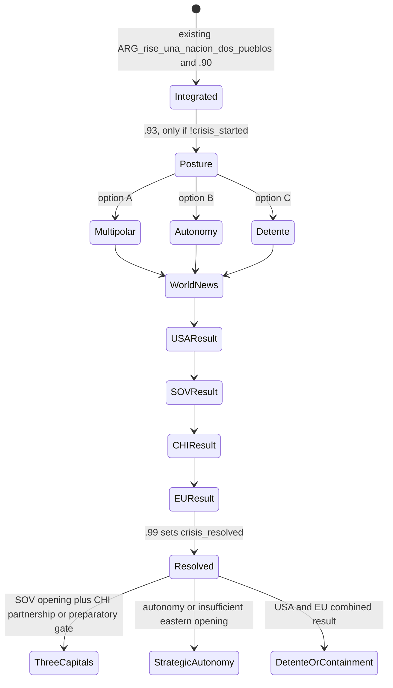

# Argentina Rise - Post-Mexico Global Crisis Implementation Blueprint v0.1.0

## 0. Authority, scope and implementation boundary

**Status:** definitive technical blueprint. This document is design and implementation planning only. It creates no event, localisation, focus, opinion modifier, idea, decision, on-action, or gameplay effect.

**Only intended future trigger:** the existing completion flow of `ARG_rise_una_nacion_dos_pueblos`, after its existing integration effects and the existing `ARG_rise.90` notification. The crisis must never replace Mexico integration, resource effects, cores, claims, or any Mexico event.

**Final reserved IDs:** `ARG_rise.93` through `ARG_rise.99`. The current live namespace ends at `.92`, verified in `events/ARG_rise_events.txt`. The implementing pass must repeat the collision scan immediately before adding code; that is an integrity check, not a new creative decision.

**Message of the chain:** Argentina has ceased to be merely a regional victor. It has become a problem that reorganises the calculations of Washington, Moscow, Beijing and Europe.

### Non-negotiable exclusions

- No war, war goal, embargo, sanction, guarantee, faction membership, faction creation, technology sharing, investment transfer, access right, timed idea, or dynamic modifier is granted in this chain.
- No Conditional Peace Deals code or GUI is used.
- No direct `EU` country tag is used. MD represents ordinary EU membership through `EU_member` and `global.EU_member`; `EUU` is a separate federalisation outcome.
- No daily scan, periodic on-action, random owned state selection, or looping event chain is used.
- The only persistent gameplay state added by the future implementation is a deliberately small set of country flags on ARG, plus one global news flag. Opinion modifiers are the only cross-country effects.

## 1. Verified source patterns

| Required mechanism | Verified source | Concrete pattern/ID | Intended use | Compatibility conclusion |
|---|---|---|---|---|
| Triggered country event | `events/ARG_rise_events.txt` | `ARG_rise.83` to `.92` | All Argentine and major-power responses | Existing submod convention; use `is_triggered_only = yes`. |
| Triggered major news | `events/ARG_rise_events.txt` | `ARG_rise.87`, `.88` | `.94`, the single international news event | Existing submod convention; use `news_event`, `is_triggered_only`, `major = yes`. |
| Delayed dispatch | `events/ARG_rise_events.txt` | `.9 -> .10`, `.17 -> .60`, `.60 -> .61` | Stagger each reaction by a fixed number of days | Existing `country_event = { id = ... days = N }` pattern. |
| Country-to-country dispatch | `events/ARG_rise_events.txt` | `.84` calls `MEX = { country_event = { id = ARG_rise.85 } }` | Dispatch USA/SOV/CHI event only when that country exists | Existing submod pattern. |
| News delay | `events/United States.txt` | `news_event = { id = usa_economic_events_news.1 days = 1 }` | `.93` queues `.94` at day 1 | MD pattern, no custom scheduler. |
| Event target preservation | `common/scripted_effects/00_public_war_weariness.txt` | `save_event_target_as`, `event_target:AB_ATT` | Preserve ARG as canonical crisis country across foreign ROOT scopes | MD uses this exact scope mechanism. |
| Opinion effect | `events/Azerbaijan.txt` | `add_opinion_modifier = { target = ROOT modifier = ... }` and `reverse_add_opinion_modifier` | Every bilateral relationship shift | MD native modifier system. |
| Opinion modifier definition | `common/opinion_modifiers/China.txt` | `opinion_modifiers = { id = { value, decay, days } }` | Future `ARG_rise_global_crisis_opinion_modifiers.txt` | MD format explicitly documents timer fields. |
| One-shot country state | `events/ARG_rise_events.txt` | `set_country_flag` and `clr_country_flag` throughout the ARG chain | Lock the route and each response | Existing submod convention. |
| One-shot global state | `common/scripted_effects/99_SOV_scripted_effects.txt` | `has_global_flag`, `set_global_flag` | Mark that global news has been released | MD native convention. |
| Bounded EU reaction | `common/scripted_effects/99_EU_voting_scripted_effects.txt` | `every_country = { limit = { has_idea = EU_member } ... }` | One event-time EU opinion pass | Verified MD pattern; never run daily. |
| EU array reference | `common/scripted_effects/99_EU_voting_scripted_effects.txt` | `for_each_scope_loop = { array = global.EU_member ... }` | Not required in first implementation | Reserved only if a later EU vote needs ordered membership. |
| NATO identity | `common/ideas/Factions.txt`, `common/scripted_effects/00_startup_effects.txt` | `NATO_member`, `global.nato_members` | USA and Europe AI context | Read-only condition, no membership mutation. |
| CSTO/SCO/BRICS state | `common/ideas/Factions.txt`, `common/scripted_effects/02_CSTO_effects.txt` | `CSTO_member`, `sco_member*`, `faction_brics_alliance` | Future diplomatic gates only | The crisis must not add such ideas. |
| Timed idea mechanics | `common/scripted_effects/99_EU_voting_scripted_effects.txt` | `add_timed_idea`, `modify_timed_idea` | Explicitly rejected for this chain | Known working system, deliberately unnecessary. |
| Deterministic AI conditions | `events/United States.txt` | option `trigger` plus `ai_chance` modifiers | Major-power option selection | Use mutually exclusive trigger gates; no lottery. |

## 2. Canonical state model

### 2.1 Ownership rules

1. ARG owns all route and response flags. It is the single source of truth.
2. The global flag only records that the international news item has entered the world state. It is never a decision gate by itself.
3. USA, SOV, CHI and European countries receive opinion modifiers, not persistent crisis flags.
4. `event_target:ARG_rise_crisis_argentina` is saved in `.93` and is the only event target retained by the chain. It is not used as a long-term gate after `.99`.
5. No variables are required. No timed ideas are required.

### 2.2 Final country flags on ARG

| Flag | Created by | Read by | Removed by | Purpose and invariant |
|---|---|---|---|---|
| `ARG_rise_post_mexico_crisis_started` | `.93` before any delayed event | `.93` trigger, `.94-.99` safety gates | Never | One-shot master guard. Once present, no second chain may start. |
| `ARG_rise_post_mexico_multipolar` | `.93` option A | `.95-.99`, future Three Capitals focus root | Only a future explicit route-reversal system | Exactly one Argentine posture flag exists. |
| `ARG_rise_post_mexico_autonomy` | `.93` option B | `.95-.99`, future autonomy focus root | Only explicit reversal | Exactly one Argentine posture flag exists. |
| `ARG_rise_post_mexico_detente` | `.93` option C | `.95-.99`, future detente focus root | Only explicit reversal | Exactly one Argentine posture flag exists. |
| `ARG_rise_USA_containment` | `.95` | `.98`, `.99`, future containment route | Never in this chain | Exactly one USA result exists. |
| `ARG_rise_USA_armed_prudence` | `.95` | `.98`, `.99`, future deterrence/detente route | Never in this chain | Exactly one USA result exists. |
| `ARG_rise_USA_pragmatism` | `.95` | `.98`, `.99`, future dialogue route | Never in this chain | Exactly one USA result exists. |
| `ARG_rise_SOV_opening` | `.96` | `.97`, `.99`, future Three Capitals root | Never in this chain | Exactly one SOV result exists; unavailable maps to deferred. |
| `ARG_rise_SOV_cautious` | `.96` | `.97`, `.99`, future preparatory focus | Never in this chain | Exactly one SOV result exists. |
| `ARG_rise_SOV_deferred` | `.96` fallback or SOV option | `.97`, `.99`, future retry focus | Never in this chain | Includes SOV absence, subject status, civil war, or refusal. |
| `ARG_rise_CHI_partnership` | `.97` | `.98`, `.99`, future economic dialogue root | Never in this chain | Exactly one CHI result exists; unavailable maps to cautious. |
| `ARG_rise_CHI_observation` | `.97` | `.98`, `.99`, future proof-of-reliability focus | Never in this chain | Exactly one CHI result exists. |
| `ARG_rise_CHI_cautious` | `.97` fallback or CHI option | `.98`, `.99`, future autonomy route | Never in this chain | Includes CHI absence, subject status, civil war, or distance. |
| `ARG_rise_EU_atlantic_condemnation` | `.98` | `.99`, future containment route | Never in this chain | Exactly one European summary exists. |
| `ARG_rise_EU_diplomatic_caution` | `.98` fallback or EU path | `.99`, future mediation route | Never in this chain | Default when no collective EU test is reliable. |
| `ARG_rise_EU_commercial_pragmatism` | `.98` | `.99`, future trade dialogue root | Never in this chain | Exactly one European summary exists. |
| `ARG_rise_post_mexico_crisis_resolved` | `.99` | Every future branch root | Never | Marks a complete, non-blocked chain. |

### 2.3 Global flag

| Flag | Created by | Read by | Removal | Rule |
|---|---|---|---|---|
| `ARG_rise_post_mexico_world_crisis` | `.94` before its option effects | Optional future world-news reactions only | Never | Informational only. It must not replace ARG's master one-shot guard. |

### 2.4 State-machine diagram

### 2.5 Conflict prevention

- `.93` must clear none of the three posture flags, because the master guard proves none can already exist. It must set exactly one route flag in each option.
- `.95`, `.96`, `.97`, `.98` must use mutually exclusive options and set exactly one result flag, including a fallback result.
- `.99` has a single acknowledgement option. It does not create a second posture or response flag.
- No option may schedule an earlier event. Only each stage dispatches its direct successor.
- No flag used here may share a generic name such as `containment`, `opening`, `partnership`, or `resolved`; every name retains the `ARG_rise_` prefix.

## 3. Definitive event contract

All events are `is_triggered_only = yes`. None are MTTH events. None require a new on-action. All display events have one or more player-facing options; there is no hidden event in the `.93-.99` range because the fallback work is contained in the same event's `immediate` or option routing.

### ARG_rise.93 - `El Mundo Contiene el Aliento`

| Field | Contract |
|---|---|
| Type | `country_event` |
| Recipient / ROOT | ARG. `ROOT = ARG`. |
| FROM | The existing focus completion scope; do not consume FROM in effects. |
| Event target | In `immediate`, ARG saves itself as `ARG_rise_crisis_argentina`. Foreign stages use this target to apply canonical flags and to target opinions safely. |
| Called by | Future one-line dispatch inserted after the existing `.90` call in the completion reward of `ARG_rise_una_nacion_dos_pueblos`. |
| Trigger | `original_tag = ARG`; `has_country_flag = ARG_rise_mexico_integrated` or the exact verified completion flag already used by the Mexico chain; `NOT = { has_country_flag = ARG_rise_post_mexico_crisis_started }`. If the integration flag does not exist, the focus completion itself remains the sole caller and the event has only the master guard. |
| Delay | Day 0, immediate after Mexico integration. |
| Creates | Master guard, event target, exactly one posture flag. |
| Removes | Nothing. |
| Global flag | None. |
| Variables / timed ideas | None. |
| Opinion effects | Applies the opening posture modifiers defined in section 5. |
| Future focus gates | Multipolar: Three Capitals candidacy. Autonomy: National Strategic Autonomy. Detente: Hemispheric Dialogue. |
| Future blocks | No hard permanent block except route-specific first focus visibility. All routes can receive later reversal or reconciliation content. |
| Decisions | None. Opening a decision before foreign answers would dilute the crisis. |
| Dispatch | Schedules `.94` after exactly 1 day. |

**Options and fixed effect set**

| Option | Flag | Opinion modifiers | Route opened |
|---|---|---|---|
| A. `Un orden de varios polos` | `ARG_rise_post_mexico_multipolar` | USA -20, SOV +15, CHI +15, EU members -5 | Three Capitals candidacy. |
| B. `La autonomia es nuestra alianza` | `ARG_rise_post_mexico_autonomy` | USA -5, SOV 0, CHI 0, EU 0 | Strategic Autonomy. |
| C. `La fuerza debe aprender a hablar` | `ARG_rise_post_mexico_detente` | USA +5, SOV -5, CHI -5, EU +5 | Hemispheric Dialogue. |

The opening modifiers are intentionally modest. The foreign responses contain the decisive additional relationship movement. This avoids double counting and preserves the sense that the world, not Argentina alone, has changed the diplomatic order.

### ARG_rise.94 - `Una Nueva Potencia Continental`

| Field | Contract |
|---|---|
| Type | `news_event` with `major = yes` |
| Recipient / ROOT | Fired from ARG's scope. `ROOT = ARG` for effects; the news is visible internationally. |
| FROM | Not read. |
| Event target | `event_target:ARG_rise_crisis_argentina` remains the authority for routing. |
| Called by | `.93`, 1 day after player posture selection. |
| Trigger | No separate trigger beyond `is_triggered_only`; `.93` must already have set master and posture state. |
| Delay | Day 1. |
| Creates | `ARG_rise_post_mexico_world_crisis` global flag. |
| Removes | Nothing. |
| Variables / timed ideas | None. |
| Opinion effects | None. News reports the change; reactions apply opinions. |
| Future focus/decision gates | None directly. |
| Dispatch | At option confirmation, route to `.95` after 1 day if USA can act. If USA cannot act, set USA armed-prudence on ARG as a non-escalatory fallback and route `.96` after 1 day. |

**Rationale for no tension effect:** the Mexican war already carried a war news event and its own world-tension consequences. A second tension increment for diplomatic recognition risks double counting. The default implementation is **zero** added world tension. A later balance pass may add a maximum `+1` only if it copies a verified MD `add_named_threat` usage and shows that Mexico integration itself did not already produce the same escalation.

### ARG_rise.95 - `El Hemisferio en Disputa`

| Field | Contract |
|---|---|
| Type | `country_event` |
| Recipient / ROOT | USA when it exists and passes safety gates. `ROOT = USA`. |
| FROM | ARG dispatch scope may be available, but all Argentine state reads/writes use `event_target:ARG_rise_crisis_argentina`, not FROM. |
| Event target | `ARG_rise_crisis_argentina`. |
| Called by | `.94` after 1 day. If USA is unavailable, `.94` performs the fallback and calls `.96` itself. |
| Trigger | `country_exists = USA`; USA is not a subject; USA has not capitulated; ARG exists; master guard exists on the ARG event target. The event must not require USA to be a major, in a faction, or at peace. |
| Delay | Day 2. |
| Creates | Exactly one USA result flag on ARG. |
| Removes | Nothing. |
| Variables / timed ideas | None. |
| Opinion effects | Applies exactly one USA response modifier, bilateral where specified in section 5. |
| Future gates | Containment: future frontier deterrence. Prudence: future strategic dialogue or deterrence. Pragmatism: future hemispheric dialogue. |
| Dispatch | Every option schedules `.96` on SOV after 2 days if valid, otherwise writes SOV deferred and schedules `.97` on CHI after 2 days. |

**Deterministic response order**

1. **Pragmatic recognition** only if all are true: ARG chose detente; USA is not at war with ARG; USA is at peace; USA-ARG opinion is at least `0`; world tension is below `35`; USA has no direct active security crisis flag identified by the implementation audit. This option is first priority.
2. **Containment** if any are true: ARG chose multipolarism; USA-ARG opinion is below `-25`; world tension is at least `50`; USA has `NATO_member` and is not in an exhausting war; ARG is in a faction opposed to USA. This option is second priority.
3. **Armed prudence** is the unconditional fallback. It also covers an overstretched USA, a USA at war, or incomplete data for a security-crisis flag.

No random weight is used. The implementation must make the three options mutually exclusive by applying the conditions in this priority order, either with `trigger` gates or a single `if / else_if / else` selector inside a one-option AI event. Human USA play may retain all narrative options that are valid, but each option must still set one and only one result flag.

### ARG_rise.96 - `Un Contrapeso en el Sur`

| Field | Contract |
|---|---|
| Type | `country_event` |
| Recipient / ROOT | SOV when valid. `ROOT = SOV`. |
| FROM | Not read for state. |
| Event target | `ARG_rise_crisis_argentina`. |
| Called by | `.95` after 2 days; `.94` fallback if USA was unavailable. |
| Trigger | `country_exists = SOV`; SOV is not a subject; SOV has not capitulated; ARG exists; master guard exists. No requirement that SOV be in CSTO, SCO, BRICS or any faction. |
| Delay | Day 4. |
| Creates | Exactly one SOV result flag on ARG. |
| Removes | Nothing. |
| Variables / timed ideas | None. |
| Opinion effects | Applies exactly one SOV response modifier. |
| Future gates | Opening: Russian side of Three Capitals. Cautious: preparatory credibility focus. Deferred: later reapproachment focus or autonomy. |
| Dispatch | Every option schedules `.97` on CHI after 2 days if valid, otherwise writes CHI cautious and schedules `.98` on ARG after 2 days. |

**Deterministic response order**

1. **Strategic opening** only if ARG chose multipolarism; SOV is not at war with ARG; SOV is not at war with USA; SOV-ARG opinion is at least `0`; SOV has not capitulated; and SOV is not in an implementation-audited internal collapse/civil-war state.
2. **Cautious interest** if ARG chose multipolarism or autonomy and SOV is otherwise valid but one opening condition is missing.
3. **Deferral** if ARG chose detente, SOV-ARG opinion is below `-25`, SOV is at war with USA, or SOV is in civil war/critical internal collapse. Absence or subject status maps to the same flag without displaying an impossible SOV event.

The response offers a channel only. It does not use `CSTO_join`, `add_ideas = CSTO_member`, a technology group, a guarantee, a faction action, or a treaty.

### ARG_rise.97 - `La Pregunta de Beijing`

| Field | Contract |
|---|---|
| Type | `country_event` |
| Recipient / ROOT | CHI when valid. `ROOT = CHI`. |
| FROM | Not read for state. |
| Event target | `ARG_rise_crisis_argentina`. |
| Called by | `.96` after 2 days; `.95` fallback if SOV invalid; `.94` fallback chain if both earlier actors are invalid. |
| Trigger | `country_exists = CHI`; CHI is not a subject; CHI has not capitulated; ARG exists; master guard exists. |
| Delay | Day 6. |
| Creates | Exactly one CHI result flag on ARG. |
| Removes | Nothing. |
| Variables / timed ideas | None. |
| Opinion effects | Applies exactly one CHI response modifier. |
| Future gates | Partnership: economic and energy dialogue. Observation: proof-of-reliability. Cautious: autonomy route. |
| Dispatch | Every option schedules `.98` on ARG after 2 days. `.98` handles the bounded EU pass and then schedules `.99` after 2 days. |

**Deterministic response order**

1. **Privileged economic partnership** only if ARG chose multipolarism or autonomy; ARG is at peace; CHI is not at war with ARG; CHI-ARG opinion is at least `0`; and USA has not chosen containment while world tension is at least `50`.
2. **Interested observation** if ARG is stable and neither party is at war with the other, but the partnership conditions are incomplete.
3. **Prudent distance** if ARG is at war with USA, CHI-ARG opinion is below `-25`, world tension is at least `75`, CHI is in civil war, or China is directly committed to a war that makes new external commitments implausible. Absence or subject status writes the same cautious result without event dispatch.

The event treats China as a commercial and strategic observer. It must not provide military participation, faction access, free investment, resource transfers, or diplomatic guarantees.

### ARG_rise.98 - `Europa Calcula la Distancia`

| Field | Contract |
|---|---|
| Type | `country_event` hosted by ARG, with a one-time bounded hidden EU-routing effect in `immediate` or the sole option. It is not an event to a fictional EU tag. |
| Recipient / ROOT | ARG. `ROOT = ARG`. |
| FROM | Not read. |
| Event target | Optional only; ROOT is ARG and is canonical here. |
| Called by | `.97` after 2 days; all earlier fallbacks eventually reach this event. |
| Trigger | Master guard exists; crisis not yet resolved; exactly one USA, one SOV and one CHI result flag must exist. If an invariant is broken, `.98` must set the missing result(s) to their cautious/deferred fallback before classifying Europe. |
| Delay | Day 8. |
| Creates | Exactly one European summary flag on ARG. |
| Removes | Nothing. |
| Variables / timed ideas | None. |
| Opinion effects | One bounded pass through existing countries with `has_idea = EU_member`; optional individual voice modifiers only for existing FRA, GER, ITA, ESP and ENG. |
| Future gates | Atlantic condemnation: containment path. Caution: mediation path. Commercial pragmatism: trade dialogue. |
| Dispatch | Schedules `.99` on ARG after 2 days. |

**Deterministic response order**

1. **Commercial pragmatism** only if ARG chose detente and USA result is pragmatism or armed prudence, world tension is below `35`, and ARG is not at war with any `EU_member` country.
2. **Atlantic condemnation** if ARG chose multipolarism and USA containment is set, or world tension is at least `50`, or ARG is at war with an EU/NATO member.
3. **Diplomatic caution** is the unconditional fallback.

**EU routing rule:** use the verified MD construct `every_country = { limit = { has_idea = EU_member } ... }` once only. The implementation must apply its selected European modifier to each current EU member. For FRA, GER, ITA, ESP and ENG, first check `country_exists` and `has_capitulated = no`; they may receive an additional named voice modifier only if the design value requires it. No event dispatch is made to every EU member, no `global.EU_member` iteration is necessary, and no individual member can block the chain.

### ARG_rise.99 - `Las Respuestas del Mundo`

| Field | Contract |
|---|---|
| Type | `country_event` |
| Recipient / ROOT | ARG. `ROOT = ARG`. |
| FROM | Not read. |
| Event target | None required. |
| Called by | `.98` after 2 days. |
| Trigger | Master guard present; crisis resolved absent. It must tolerate any valid combination of response flags. Missing flags are normalised to fallback in `immediate` before localisation or future gate calculation. |
| Delay | Day 10. |
| Creates | `ARG_rise_post_mexico_crisis_resolved`. Optional derived eligibility flags are rejected; use the canonical response flags in focus triggers instead. |
| Removes | Nothing. The temporary event target may be cleared here only if MD scope semantics allow safe clearing; it is not a gameplay requirement and leaving it is harmless. |
| Variables / timed ideas | None. |
| Opinion effects | None. This event reports prior choices rather than adding another diplomatic layer. |
| Future focus gates | Three Capitals full/preparatory, Strategic Autonomy, Hemispheric Dialogue or Hemispheric Deterrence as defined in section 7. |
| Decisions | None. The next player agency must be a focus branch, not an immediate menu of decisions. |
| Dispatch | None. This is the terminal node. |

## 4. Timeline and routing guarantee

| Day | Event | Owner | Required action | Failure-safe continuation |
|---|---|---|---|---|
| 0 | `.93` | ARG | Player chooses posture; master guard and event target are written | Cannot start twice because master guard is set before delay. |
| 1 | `.94` | global news from ARG scope | World sees the new continental power; global news flag written | If USA is absent/unavailable, set USA armed prudence fallback and route onward. |
| 2 | `.95` | USA | USA records containment, prudence, or pragmatism | Invalid USA is handled in `.94`; all valid `.95` options route SOV. |
| 4 | `.96` | SOV | SOV records opening, caution, or deferral | Invalid SOV is handled by caller; all valid `.96` options route CHI. |
| 6 | `.97` | CHI | CHI records partnership, observation, or caution | Invalid CHI is handled by caller; all valid `.97` options route Europe. |
| 8 | `.98` | ARG | One European summary and one bounded EU opinion pass | Missing European actors do not matter; EU caution is fallback. |
| 10 | `.99` | ARG | Chain closes and future focus gates become readable | Missing foreign result is normalised to fallback, then resolved flag is always written. |

### Routing pseudocode contract

This is a flow contract, not code to paste:

1. A stage writes its own actor result before it schedules the next stage.
2. A caller tests target existence and validity before dispatch.
3. If target cannot receive an event, caller writes that actor's predetermined fallback flag on ARG and dispatches the next stage after the same delay.
4. Every route reaches `.98`, and `.98` always reaches `.99`.
5. `.99` validates the one-result-per-actor invariant and writes only the resolution flag.

This design prevents a collapsed, annexed, puppeted, civil-war or otherwise unavailable major from leaving Argentina in a permanently unfinished diplomatic state.

## 5. Opinion modifier specification

### 5.1 Future file and format

Future implementation creates one new submod-only file:

`common/opinion_modifiers/ARG_rise_global_crisis_opinion_modifiers.txt`

It must copy the `opinion_modifiers = { ... }` file structure from:

`E:\Steam\steamapps\workshop\content\394360\2777392649\common\opinion_modifiers\China.txt`

Use named modifiers with `value`, `decay`, and explicit `days = 730`. MD's header comments in that file document `days`, `months`, and `years` as supported timer fields. The value below is the full relationship effect for the named modifier. Where bilateral perception is desired, apply the same modifier through both `add_opinion_modifier` and `reverse_add_opinion_modifier`, following `events/Azerbaijan.txt`.

### 5.2 Modifier catalogue

| ID | Applied by / received by | Value | Duration | Narrative purpose | Localised tooltip and description intent |
|---|---|---:|---|---|---|
| `ARG_rise_opinion_arg_multipolar_usa` | USA -> ARG | -20 | 730 days | Washington reads Argentina's posture as a challenge to hemispheric primacy. | `Argentina has declared a multipolar course.` |
| `ARG_rise_opinion_arg_multipolar_sov` | SOV -> ARG and ARG -> SOV | +15 each direction | 730 days | Moscow sees strategic room in the South. | `Argentina seeks a more plural international order.` |
| `ARG_rise_opinion_arg_multipolar_chi` | CHI -> ARG and ARG -> CHI | +15 each direction | 730 days | Beijing sees a potential independent interlocutor. | `Argentina has opened itself to a multipolar world.` |
| `ARG_rise_opinion_arg_multipolar_eu` | each EU member -> ARG | -5 | 730 days | Europe reacts with initial Atlantic concern, without a collective rupture. | `Europe is cautious about Argentina's multipolar declaration.` |
| `ARG_rise_opinion_arg_autonomy_usa` | USA -> ARG | -5 | 730 days | Independence is unsettling but not openly hostile. | `Argentina insists on strategic autonomy.` |
| `ARG_rise_opinion_arg_detente_usa` | USA -> ARG and ARG -> USA | +5 each direction | 730 days | Buenos Aires signals that strength can coexist with diplomatic restraint. | `Argentina has offered a vigilant detente.` |
| `ARG_rise_opinion_arg_detente_eu` | each EU member -> ARG | +5 | 730 days | Europe sees room for managed relations. | `Argentina has chosen diplomatic restraint.` |
| `ARG_rise_opinion_arg_detente_eastern` | SOV -> ARG and CHI -> ARG | -5 each | 730 days | Moscow and Beijing doubt Argentina's long-term alignment. | `Argentina's detente creates uncertainty in the East.` |
| `ARG_rise_opinion_usa_containment` | USA -> ARG and ARG -> USA | -25 each direction | 730 days | The United States establishes a political posture of containment, not a war state. | `The United States regards Argentina as a hemispheric strategic challenge.` |
| `ARG_rise_opinion_usa_prudence` | USA -> ARG | -10 | 730 days | Washington prepares and observes without closing every diplomatic door. | `The United States is responding with armed prudence.` |
| `ARG_rise_opinion_usa_pragmatism` | USA -> ARG and ARG -> USA | +10 each direction | 730 days | Both capitals accept that confrontation is not immediately inevitable. | `The United States has pragmatically recognised Argentina's new position.` |
| `ARG_rise_opinion_sov_opening` | SOV -> ARG and ARG -> SOV | +20 each direction | 730 days | Moscow opens a serious strategic channel. | `The Soviet government sees Argentina as a possible counterweight in the South.` |
| `ARG_rise_opinion_sov_caution` | SOV -> ARG | +5 | 730 days | Interest exists, but commitments are withheld. | `The Soviet government is watching Argentina cautiously.` |
| `ARG_rise_opinion_sov_deferral` | SOV -> ARG | -5 | 730 days | Moscow declines to transform interest into a channel. | `The Soviet government has deferred engagement with Argentina.` |
| `ARG_rise_opinion_chi_partnership` | CHI -> ARG and ARG -> CHI | +20 each direction | 730 days | Beijing identifies a future commercial and strategic partner. | `China sees a stable Argentine channel for long-term cooperation.` |
| `ARG_rise_opinion_chi_observation` | CHI -> ARG | +5 | 730 days | China retains interest while demanding proof of stability. | `China is observing Argentina's rise with interest.` |
| `ARG_rise_opinion_chi_distance` | CHI -> ARG | -5 | 730 days | Beijing chooses distance amid escalation risks. | `China judges the Argentine situation too volatile for a new commitment.` |
| `ARG_rise_opinion_eu_atlantic_condemnation` | each EU member -> ARG | -15 | 730 days | European governments align their first response with Atlantic security concern. | `European governments condemn Argentina's strategic turn.` |
| `ARG_rise_opinion_eu_caution` | each EU member -> ARG | -5 | 730 days | Europe delays judgement and avoids a formal rupture. | `European governments are proceeding with diplomatic caution.` |
| `ARG_rise_opinion_eu_pragmatism` | each EU member -> ARG | +5 | 730 days | Commercial interests prevail over immediate alignment pressure. | `European governments see value in a pragmatic Argentine relationship.` |

### 5.3 Opinion stacking rules

- Opening posture modifiers and foreign response modifiers intentionally stack. They represent two distinct facts: Argentina's declared posture and the foreign capital's answer.
- No event may apply the same named modifier twice. The master guard ensures `.93` is unique; one-result-per-actor flags ensure response uniqueness.
- No extra generic modifier such as `recent_actions_negative` may be added. It would conceal causality from the player and make balancing opaque.
- `days = 730` makes the initial crisis matter for two in-game years without becoming permanent diplomatic destiny. Future focuses may add, replace, or explicitly remove their own named modifier only after a documented reconciliation/escalation design.

## 6. AI design: deterministic priority gates

The AI must not select outcomes through arbitrary percentage weights. The implementation should use ordered, mutually exclusive condition sets: first valid priority wins; final option is always fallback. `ai_chance` may use `base = 1` only where the engine requires it after all other options are invalidated, never as a balancing lottery.

### 6.1 Shared inputs

| Input | Why it matters | Source pattern |
|---|---|---|
| World tension thresholds `35`, `50`, `75` | Distinguishes calm, contested and crisis world states | Existing MD event triggers use tension and threat context; exact trigger spelling must be copied from a current MD event during implementation. |
| Bilateral opinion thresholds `0` and `-25` | Avoids friendly response to an actively hostile relationship | `add_opinion_modifier` system and standard country relation triggers. |
| `has_war = yes` / no direct ARG war | Major powers at war should not make gratuitous commitments | MD scripted effects and events use `has_war = no`. |
| `is_subject = no`, `has_capitulated = no`, `country_exists` | Eliminates invalid recipients and non-sovereign actors | `events/NATO_system.txt` and standard event checks. |
| `NATO_member` | Identifies Atlantic security context, not a universal enemy label | `common/ideas/Factions.txt`. |
| `EU_member` | Identifies current EU countries for collective response | `99_EU_voting_scripted_effects.txt`. |
| Existing ARG posture/result flags | Makes every reaction responsive to prior chain state | Existing ARG flag pattern. |

### 6.2 USA selector

| Priority | Result | All required conditions |
|---:|---|---|
| 1 | Pragmatic recognition | Detente; USA at peace; no USA-ARG war; USA-ARG opinion >= 0; tension < 35; no implementation-audited USA internal-security crisis. |
| 2 | Containment | Multipolar **or** opinion < -25 **or** tension >= 50 **or** ARG faction opposed to USA; USA is not in an exhausting war. `NATO_member` reinforces this branch but is not sole proof. |
| 3 | Armed prudence | All remaining valid USA states, including wars, debt/overstretch indicators where safely verified, and ambiguous cases. |
| Fallback | Armed prudence flag without USA event | USA absent, subject, capitulated or otherwise invalid. |

### 6.3 SOV selector

| Priority | Result | All required conditions |
|---:|---|---|
| 1 | Strategic opening | Multipolar; SOV not at war with ARG or USA; opinion >= 0; SOV sovereign and not capitulated; no SOV civil war/collapse condition identified by the implementation audit. |
| 2 | Cautious interest | Multipolar or autonomy; sovereign SOV; not at war with ARG; any opening condition missing. |
| 3 | Deferral | Detente **or** opinion < -25 **or** SOV-USA war **or** civil war/collapse condition. |
| Fallback | Deferred flag without SOV event | SOV absent, subject or capitulated. |

### 6.4 CHI selector

| Priority | Result | All required conditions |
|---:|---|---|
| 1 | Privileged economic partnership | Multipolar or autonomy; ARG at peace; no CHI-ARG war; opinion >= 0; not `(USA containment and tension >= 50)`; CHI sovereign and stable. |
| 2 | Interested observation | ARG and CHI not at war with one another; ARG stable; no distance condition. |
| 3 | Prudent distance | ARG-USA war **or** opinion < -25 **or** tension >= 75 **or** CHI civil war/direct major-war commitment. |
| Fallback | Cautious flag without CHI event | CHI absent, subject or capitulated. |

### 6.5 Europe selector

| Priority | Result | All required conditions |
|---:|---|---|
| 1 | Commercial pragmatism | Detente; USA pragmatism or prudence; tension < 35; ARG not at war with an EU member. |
| 2 | Atlantic condemnation | Multipolar and USA containment, **or** tension >= 50, **or** ARG at war with EU/NATO member. |
| 3 | Diplomatic caution | All other cases, including no current EU members. |

### 6.6 Economy and stability requirement

The requested economic and stability context is included only where an existing, stable MD representation is verified at implementation time. This blueprint prohibits guessing an economic variable name. The mandatory baseline is war state, tension, relation, faction ideas, sovereignty and capitulation. If the implementer verifies a current MD country variable for debt, GDP or stability, it may only **downgrade** a favourable result to the cautious fallback; it must not create a new result or change the priority order. Native `stability` is safe to consult if its syntax is copied from an existing MD condition.

## 7. Future content gates, without future implementation

These are exact future focus gate outcomes, not focus designs. The crisis unlocks possibilities; it does not create any focus in this pass.

| Future branch | Required canonical state | Explicitly not required | Locked/secondary state |
|---|---|---|---|
| Three Capitals, full conference | Multipolar + SOV opening + CHI partnership + crisis resolved | Alliance, CSTO/SCO/BRICS membership, USA hostility | Autonomy and detente roots are secondary. |
| Three Capitals, preparatory diplomacy | Multipolar + one of SOV opening/CHI partnership + other cautious/observation + resolved | Any guarantee or tech sharing | Full conference remains locked until preparatory focus. |
| National Strategic Autonomy | Autonomy + resolved, **or** resolved with both eastern actors cautious/deferred | Hostility to USA or Europe | Always available as safety route. |
| Hemispheric Dialogue | Detente + USA pragmatism + EU commercial pragmatism + resolved | USA alliance, NATO status | Containment branch remains unavailable. |
| Hemispheric Deterrence | USA containment + EU Atlantic condemnation + resolved | War goal, mobilisation spirit, formal enemy faction | Dialogue root is unavailable until a later reconciliation design. |
| European Mediation | EU diplomatic caution + resolved | Any USA result | A small optional diplomatic side route. |

No decisions are enabled or disabled during `.93-.99`. The first future decision may be introduced only after the corresponding root focus exists; this keeps player agency legible and prevents an empty decision category.

## 8. Narrative contract

### 8.1 Event progression

| Event | Emotional function | Required narrative fact | Must not say |
|---|---|---|---|
| `.93` | Sovereign recognition | Mexico has made Argentina a continental fact; the northern frontier changes the map. | That conquest automatically grants a world alliance. |
| `.94` | Global recognition | The world receives a strategic shock, not merely a war report. | That war begins now or that anyone has committed troops. |
| `.95` | Hemispheric gravity | Washington realises distance is no longer security. | That containment equals war. |
| `.96` | Opportunity and restraint | Moscow sees a possible counterweight, but not a client. | That Argentina is joining CSTO or a Russian bloc. |
| `.97` | Economic calculation | Beijing asks whether Argentina is stable enough to matter over decades. | That China is sending aid, troops or guarantees. |
| `.98` | Divided order | Europe measures Atlantic loyalty against commerce and diplomacy. | That an EU tag or one leader speaks for all Europe. |
| `.99` | Transformation | Argentina reads the answers and understands it is now a variable in global order. | That the next war is inevitable. |

### 8.2 Localisation direction

The final localisation set must be Spanish source text plus English and Italian translations, following the existing submod localisation files and their UTF-8 BOM requirements. Each event requires title, description and each option key. Each opinion modifier requires a visible name and a one-line explanatory description. No numeric relationship values appear in prose.

The recurring line to protect is: **Argentina is no longer a regional power. It has become a global problem.** It should be expressed through the reactions, never as a blunt tooltip.

## 9. Technical safety audit

### 9.1 No repeat guarantee

| Risk | Prevention |
|---|---|
| Focus completion replays or console invocation of `.93` | `.93` has `NOT has_country_flag = ARG_rise_post_mexico_crisis_started`; master flag is written before dispatch. |
| News repeats | `.94` is reachable only from valid `.93`; `.94` additionally checks global flag before writing/scheduling. |
| Foreign event fires twice | Only the prior stage may dispatch it; prior actor result is written before next dispatch. Its recipient event checks absence of its own ARG result family. |
| Conclusion repeats | `.99` requires absence of `ARG_rise_post_mexico_crisis_resolved`, then writes it. |
| On-action duplicate | No on-action is used. |

### 9.2 Missing actor guarantee

| Missing/invalid actor | Exact fallback | Next stage |
|---|---|---|
| USA | Write `ARG_rise_USA_armed_prudence` on ARG; do not call USA | SOV at day 4 equivalent routing. |
| SOV | Write `ARG_rise_SOV_deferred` on ARG; do not call SOV | CHI at day 6 equivalent routing. |
| CHI | Write `ARG_rise_CHI_cautious` on ARG; do not call CHI | Europe at day 8 equivalent routing. |
| No EU members / all named voices absent | Write `ARG_rise_EU_diplomatic_caution`; bounded pass affects zero countries safely | `.99` at day 10. |
| ARG invalid | Impossible under normal focus completion. All delayed events must nevertheless check the saved Argentine event target exists; if absent, terminate silently and never touch another country. |

### 9.3 Scope guarantee

- Foreign event `ROOT` is its recipient: USA, SOV or CHI.
- Foreign event must never write Argentina's canonical flags through `ROOT` or assume `FROM` remains stable through delays.
- `.93` saves ARG as `event_target:ARG_rise_crisis_argentina`; foreign events write canonical flags through that target.
- `.98` and `.99` are ARG-rooted, so they use ROOT directly.
- Opinion effects use the known MD format, targeting `event_target:ARG_rise_crisis_argentina` from the foreign ROOT. Bilateral use requires a mirrored call, as in the Azerbaijan pattern.

### 9.4 No unintended double count

- World tension: default zero in `.94`.
- Opinion: one opening modifier plus one response modifier per actor. EU receives one opening modifier and one response modifier, each only once per member.
- No ideas or dynamic modifiers exist, so no hidden national-stat stacking can occur.
- No resource, state, core, building, research, political power, Treasury or army effect is in scope.

### 9.5 Required implementation verification checklist

1. Confirm live `ARG_rise` IDs `.93-.99` are unused.
2. Confirm the exact Mexico integration completion caller and any existing integration flag; do not fabricate one.
3. Confirm all braces and event IDs after code insertion.
4. Confirm all localisation files have UTF-8 BOM and all keys exist in Spanish, English and Italian.
5. Test each `.93` posture manually in a controlled ARG save.
6. Test USA, SOV and CHI normal route, absence route, subject route and capitulated route through console/state setup.
7. Test zero-current-EU-member route and normal `EU_member` route.
8. Inspect `error.log` after every route. No undefined modifier, invalid scope, unknown event target or missing localisation key is acceptable.
9. Confirm no Conditional Peace Deals GUI, MIO, doctrine, asset or save file is touched.
10. Confirm `.99` always arrives at day 10 equivalent and `ARG_rise_post_mexico_crisis_resolved` is present exactly once.

## 10. Future file map

The following is the complete future implementation surface. It is intentionally small.

| File | Future change | Why |
|---|---|---|
| `events/ARG_rise_events.txt` | Add `.93-.99` only | Existing ARG namespace and event style. |
| `common/national_focus/ARG_rise_focus_tree.txt` | Add one dispatch to `.93` after existing Mexico integration flow | Correct entry point; no new focus required. |
| `common/opinion_modifiers/ARG_rise_global_crisis_opinion_modifiers.txt` | Create the named modifiers in section 5 | Keeps relationship values declarative and localised. |
| `localisation/spanish/ARG_rise_global_crisis_l_spanish.yml` | Create/add event and modifier localisation | Spanish narrative source. |
| `localisation/english/ARG_rise_global_crisis_l_english.yml` | Create/add translation | Required language coverage. |
| `localisation/italian/ARG_rise_global_crisis_l_italian.yml` | Create/add translation | Required language coverage. |

Do not modify Millennium Dawn, vanilla HOI4, existing Mexico decisions, Mexico event IDs `.83-.90`, on-actions, dynamic modifiers, ideas, state history, assets or the save game.

## 11. Final implementation decision

The chain should contain exactly seven events: one Argentine posture event, one global news event, three major-power responses, one technically correct European reaction, and one Argentine conclusion. None is superfluous:

- removing `.94` makes the transformation private and weakens the global premise;
- removing any major response collapses a distinct strategic voice;
- splitting Europe further would create noise and technical risk without stronger gameplay;
- removing `.99` leaves the player without a readable synthesis or clean focus gates.

The result is intentionally restrained. It changes diplomatic meaning, not military balance. The implementation can proceed later without any unresolved creative choice: IDs, scope ownership, event order, fallback states, opinion values, route gates, narrative function and prohibited effects are fixed here.
